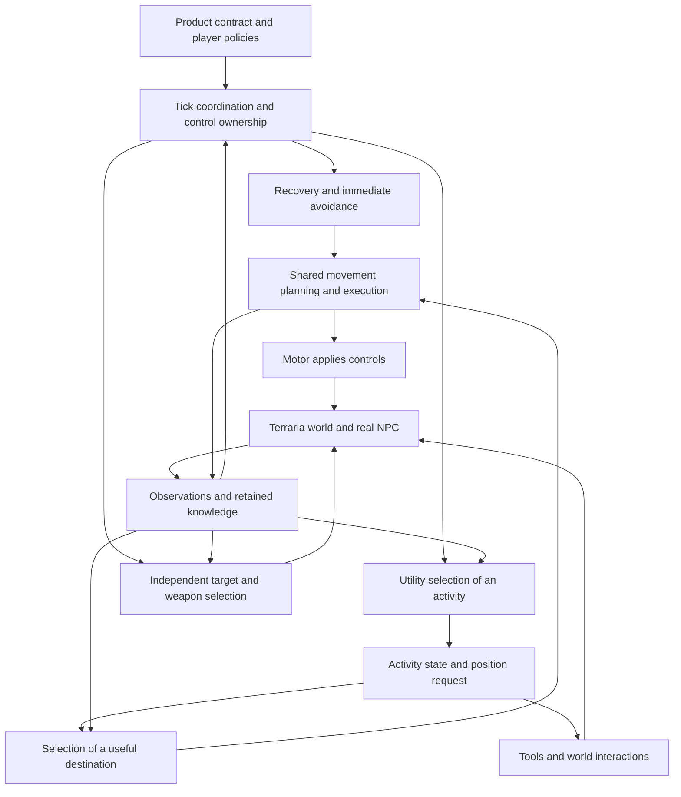

# The companion is a feedback system with several decision owners

This initial survey is retained as the responsibility map. The expanded [behaviour and comparison criteria](<Decision Architecture/Behaviour, Opportunities and Comparison Criteria.md>), [source investigation](<Implementation Evidence/CLAUDE.md>) and [ranked roadmaps](proposal/CLAUDE.md) incorporate the later owner clarifications and deeper evidence. Architecture-specific claims below belong to the dated baseline.

Investigation date: 12 September 2026, Europe/London. Source baseline: `4296f851b13e49ccd557d7255ec24bc223a29929`, version `0.15.1`. Status: research for discussion; no replacement architecture has been accepted.

The question is whether the project is improving a suitable architecture or repeatedly compensating for unsuitable abstractions. The standard is the companion in the [README](../README.md): a nearby, useful second presence that notices opportunities, protects itself and the player, completes worthwhile work, and moves through Terraria without becoming an orders system. The owner judges the resulting play. There is no deadline or mandate to pick a replacement in this investigation.

**Utility remains a plausible mechanism for comparing immediate preferences. The evidence does not establish that it should govern every responsibility, that the current scoring model is adequate, or that replacing it would cure the observed failures.** The most productive starting point is to identify which decisions belong together and what information they require. The detailed comparison is in [Utility AI and Its Alternatives](<Utility AI and Its Alternatives.md>); the history and evidence reports explain why this assessment is provisional.

## The outer boundary is the intended experience and the information available to produce it

The proposed circles are useful as a way to descend from purpose to mechanics. The current system, however, has shared observations and feedback between layers, so it cannot be accurately drawn as utility enclosing everything else.

This diagram describes responsibility and feedback, not a proposed rewrite or an exact call graph. Product rules constrain every branch. Observation supplies multiple consumers. Movement answers feasibility questions for decisions above it, as well as executing their requests. The quality of the whole depends on those answers having consistent meanings.

At the baseline, [CoordinateBrainTick.cs](../Companion/Brain/CoordinateBrainTick.cs) updates observations, checks active recovery and immediate collision avoidance, and only then reaches ordinary behaviour selection. A reflex tick can return before the chooser runs. The hands still receive an opportunity to fire. On an ordinary tick, the selected activity supplies work and a position request, position selection finds a useful destination, shared movement controls travel, and the arsenal chooses a shot independently when the hand is free. Survival also has a specialised escape path.

Consequently there is already policy above utility. The question is whether that policy coordinates the body correctly. Calling the entire system “utility AI” hides this existing hybrid structure, and can misattribute an interruption made by the coordinator to an action's score.

## The requirements contain choices that should remain visible during research

The Expected Behaviour story is valuable because it describes the experience across time. Several passages also prescribe internal machinery: no held plan, no modes and no sequenced list of jobs. Those claims sit uneasily beside the README's own requirement that Expected Behaviour remain meaningful after an architectural replacement.

There are two materially different readings. One asks the companion to remain responsive, avoid remote errands and stop obsolete work; an interruptible plan can satisfy that. The other forbids internal sequencing even when the outward behaviour is identical; that removes candidates before comparing them. This research uses observable behaviour as the comparison standard and marks the stronger interpretation as an open decision. It does not silently revise the README.

Other tensions deserve the same treatment:

| Requirement pair | Why the distinction affects architecture | Decision still needed |
|---|---|---|
| Establish that an excursion is feasible; investigate unfamiliar terrain | Limited computation or unobserved terrain can leave reachability unknown. A safe first move may reveal more without certifying the full trip. | What may the companion do while it is uncertain, and what must it prove first? |
| Stop work when the player needs it; resume a worthwhile nearby job afterwards | Forgetting every interrupted job loses useful continuity; retaining every job can create unwanted remote obligations. | What evidence keeps a job relevant, and what retires it? |
| Treat hazards as a cost; be very difficult to kill | A scalar penalty permits trade-offs. A hard safety condition prohibits some of them. | Which risks are preferences, and which actions must be excluded? |
| Hunt to make exploration useful; do not wander away merely to fight | Enemy value alone does not represent unexplored space, the return trip, or the benefit of learning what is beyond a passage. | What is exploration worth independently of killing an enemy? |
| React immediately; perform a jump or escape coherently | A physically necessary sequence can become less safe if restarted by every new decision. | Which interruptions preserve a move, replace its controls, or cancel its destination? |

These are product and control questions before they are utility-versus-tree questions. An algorithm can enforce a chosen answer, but cannot supply the owner's preference for it.

## Each layer has a different reason to retain or change it

The judgements below are inferences from the baseline code, its documented responsibilities and the historical evidence. They are not comparative benchmark results.

| Layer | What it currently decides | What appears suitable | What remains questionable | What would make a different shape worth testing |
|---|---|---|---|---|
| Product constraints and policy | Permitted work, autonomy, proximity, protection and equipment boundaries | A closed ability set limits the problem and makes individual actions checkable. | Requirements sometimes encode a mechanism or demand certainty the observations cannot supply. | A behaviour example that cannot be reconciled without choosing between two written requirements. |
| Observation and memory | Player heading/activity, threats, terrain, light, body state and retained facts | Shared observation avoids each behaviour inventing its own world. | Coverage, freshness and uncertainty differ by fact. Existing memory is unevenly connected to decisions. | Repeated failures where the desired distinction is absent from the input, regardless of selector. |
| Tick coordination and resource ownership | Whether recovery, avoidance, survival or ordinary travel controls the body; whether tools occupy the hand | One motor boundary and independent hands match simultaneous movement and shooting. | Multiple interruption paths can disagree about retained movement and safety. | A controlled replay showing a valid escape lost specifically through handoff, with sensors and physical feasibility held constant. |
| Utility selection | Which ordinary activity warrants attention | Continuous comparisons fit changing distance, pressure, opportunity and remaining work. | Shared score scales, vetoes, incumbent preference, stateful scoring and prediction horizon may distort those comparisons. | Labelled situations in which desired ordering cannot be represented cleanly, or requires repeated unrelated exceptions. |
| Activity execution | Target/job retention, approach, tool phase and local completion | Retained ore jobs and survival state already provide temporal structure. | There is no common account of progress, interruption and terminal outcome across every activity. | Task failures repeatedly require the coordinator to infer meaning from body displacement or action names. |
| Position selection | Which reachable place satisfies following, work or shooting | Separating a useful destination from a route is sound for these different intents. | Cheap candidate ranking limits which places receive expensive proof; uncertainty and retained regions matter. | A known useful destination is omitted before route search or shot solving can consider it. |
| Route search and world memory | How to connect standing locations using available moves | A* and retained search are plausible for a bounded graph; executed route memory can avoid rediscovering real traversals. | A representative graph state can merge physically different approaches. One-way permission, cost and budget policy also restrict the result. | A matched case separates absent edges, state aliasing, search exhaustion and control failure. |
| Movement execution and simulation | Which controls can perform the next part from the actual state | Actual-entry validation directly addresses a recurring historical failure class. | Native and portable collision models differ; long-term safety is not implied by a locally valid prefix. | A physically executable move is consistently rejected, or an admitted move fails under matched native conditions. |
| Arsenal and projectile aiming | Which legal weapon-target pair offers a useful shot | Independent shooting supports the intended companion behaviour. | Acquisition, firing position and final shot status can disagree or be misread. | A candidate audit shows a physically valid, valuable shot being dropped at a particular stage. |
| World interactions and persistence | Legal terrain edits, actual tool effects, cargo and saved state | Explicit abilities and home protection give clear boundaries. | Decision eligibility must match actual capability, supplies, inventory and changing terrain. | An admitted job cannot produce its promised effect despite valid movement and policy. |
| Diagnostics and acceptance | What evidence explains a decision and what a check proves | Native replay, decision evidence and real captures are substantial assets. | Recorded labels can be stale; event populations differ; fixtures cover only their inputs. | A conclusion cannot be reconstructed from recorded ownership, candidates, state and outcome. |

A replacement chooser could reuse much of the observation, arsenal, tool, terrain and motor machinery. Reuse would still require adapting contracts: a symbolic planner wants preconditions and effects; a tree wants explicit execution and cancellation status; a learned policy wants a stable observation/action definition. “Everything must change if utility changes” overstates the coupling. “Only swap the chooser” understates it.

## The README's responsibilities cross several layers

The baseline table contains **27 named rows**, although the root guide at the baseline revision described twenty-five. The mapping below includes all 27. It names the first responsibility to inspect rather than assigning every symptom to a single owner. Detailed claims in the README are subject to the corrections in [Evidence and Open Questions](<Evidence and Open Questions.md>).

| README responsibility | First boundary to examine | Architectural question |
|---|---|---|
| Getting out of the player's way | Player intent → position selection | Is occupied/needed player space represented as a destination cost or constraint? |
| Boss and event behaviour | Threat interpretation → safety and activity preference | Does changing pressure produce the requested play without a brittle encounter-specific script? |
| Reading where the player is going | Player observation → follow objective | Is prediction trusted only while it remains physically useful? |
| Enemy selection | Candidate admission → arsenal forecast | Is the missed opportunity absent, rejected, or merely outscored? |
| Chaining several jobs into one trip | Opportunity representation → activity continuity | Can short-term choices value a worthwhile trip without creating remote obligations? |
| Knowing what it cannot do | Search result → decision policy | Are unknown, disproven and currently unaffordable separate answers? |
| Committing to a decision | Activity state → switch policy | Does continuing reflect remaining benefit and task progress? |
| Firing position | Target opportunity → destination candidates | Is there a reachable place with a shot, and does it survive cheap filtering? |
| Self-preservation | Danger observation → control ownership → escape | Does safety reach the controls on the ticks when it is needed? |
| Lighting the area | Spatial knowledge → lighting opportunity | Is an unlit region a meaningful goal, beyond local brightness and torch placement? |
| Deciding what counts as a threat | Enemy model → harm and intervention estimate | Can an unattackable enemy remain dangerous? |
| Traversing terrain | Edge admission → actual-state performance | Does the move work from the body state that arrives? |
| Protecting the player | Harm forecast → intervention value | Does the chosen action reduce harm in time? |
| Breaking containers | Pot job → approach → interaction | Is continued effort still worthwhile when the approach is failing? |
| Dodging and kiting | Immediate avoidance → retained travel | Does a local dodge improve the longer escape rather than repeatedly disrupt it? |
| Opportunistic mining | Ore discovery → approach proof → retained vein | What is permitted when ore exists but its approach is unknown? |
| Reporting what it is doing | Actual ownership and task state → explanation | Can the explanation distinguish retained labels from decisions made this tick? |
| Finding a route | Graph/model → search → reachability result | Is the failure in representation, search work, policy or execution? |
| Staying with the player | Follow objective → usable destination → arrival | Does arrival mean satisfying companionship rather than reaching a waypoint? |
| Looting | Cargo capacity → pickup target → contact | Is a drop eligible and useful before the companion walks to it? |
| Weapon selection | Legal attacks → useful outcome comparison | Are finishing, collateral hits and harm removed represented consistently? |
| Recovering when it cannot follow | Follow eligibility → continuous recovery | Does recovery finish in a usable place without contaminating ordinary route memory? |
| Changing the world | Permission → tool effect → terrain revision | Do every autonomous edit and its downstream caches honour the same boundary? |
| Movement abilities | Capability state → graph and control generation | Does gaining an ability widen all relevant feasibility queries consistently? |
| Doors | Terrain affordance → route → interaction | Does the movement model account for a legal door interaction? |
| Getting up after being downed | NPC lifecycle → recovery state | Which timers and invariants belong outside ordinary activity selection? |
| Opportunistic chopping | Observed player work → tree job → tool effect | Does helping remain relevant as the player and worksite change? |

## A* needs a separate investigation into its graph and execution contract

A* searches the graph supplied to it; whether that graph represents the task is a separate question. Planning literature distinguishes discrete search from motion planning with dynamic constraints for precisely this reason. The relevant starting points are Chapters 2 and 14 of Steven LaValle's [Planning Algorithms, 2006](https://lavalle.pl/planning/).

At this baseline, `NavNode` in [NavPath.cs](../Companion/Brain/SharedMovementSystem/RoutePlanning/NavPath.cs) contains a tile and mobility-resource state. It does **not** contain the body's full pose and velocity. The full dynamic `BodyState` belongs to simulation and local control search. The README's movement-abilities row conflates these. The distinction matters: two bodies reaching the same tile with different velocities can require different controls even when the coarse route node is identical.

The history strongly supports investigating that boundary. It does not prove that continuous-state global search is preferable. A larger state representation can avoid false equivalences but costs more search and demands a useful discretisation. A coarse route with local verified controls can be efficient but needs a reliable handoff and an adequate representation of which moves exist. Pure local steering is inexpensive but does not by itself solve routes whose first leg moves away from the destination. Incremental search can reduce repeated work while retaining the same modelling mistakes.

The next navigation comparison should therefore hold the terrain and desired destination fixed, then ask in order: does an executable route exist in the native world; is it represented in the graph; does search find it within its resources; can the controller execute it under interruptions? Changing the search algorithm before separating these is liable to reproduce the same failure under a new name. This is a research sequence, not a finding that A* should stay.

## The first discussion should settle the unit of a decision

There are at least three viable units: the next immediate action, a continuing nearby activity, or a goal that may require a sequence of activities. The current system mixes them. Mining retains a vein, hunting retains a target and opportunity, survival retains an escape, while the chooser compares all of them on one tick's score.

My provisional preference is to investigate **continuing, interruptible nearby activities** as the comparison unit, using the existing retained jobs as the baseline. The strongest counterargument is that extra lifecycle machinery could formalise a problem better handled by a few local rules, or make the companion stubborn. A small set of actual play situations should decide whether that structure is useful. The utility report compares the alternatives on that basis and includes conditions that would favour a hierarchy, planning or learning instead.

Only the research process is settled: preserve the history, map alternatives, make uncertainty explicit, and use this folder for the discussion. Utility, the meaning of commitment, safety policy, exploration memory and navigation architecture remain open.
