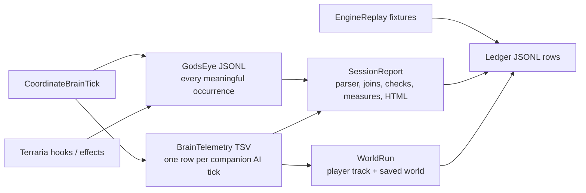

> Source map, 19 September 2026, at `d315bf2`. Proposed details here are investigative inputs; the [implementation plan](<../proposal/Implement the Retained Course Brain.md>) owns the final design. In particular, it chooses typed JSON payloads and distinguishes cave descent from a motion discontinuity.

# Retained-course telemetry map — implementation-facing evidence contract

**Scope and baseline.** Read-only mapping at `d315bf2` (0.30.7). The repository has one modified Proposal 04 file and ten untracked ledger runs; none were touched. This plan instruments the retained-course implementation proposed in `research/proposal/Implement the Retained Course Brain.md`; it does **not** select its objective, relevance policy, or utility formula.

The minimum useful contract is not a complete recording of the future. It must let a reader answer seven bounded questions for any observed course transition: **what concrete opportunity was considered; what facts/effects made its binding admissible; why it was selected, retained, repaired, or rejected; what execution resources it claimed; what the native world actually did; which relevant fact changed; and what the planner knew versus had not yet resolved.** A row that cannot support one of those questions must say `unobserved`, `unknown`, `partial`, or `not-applicable`; absence must never read as zero.

## The existing evidence route and its boundaries

| Surface | Current owner and source | What it proves now | Limits that matter for courses |
|---|---|---|---|
| Per-tick state | `Companion/Brain/Infrastructure/Diagnostics/RecordBrainTelemetry.cs:97, 597-691` | Schema 0.40.0 TSV, source/config/world/capability preamble, one row per companion AI tick; selected action, activity identity/phase, score board, request, movement/firing/attempt fields and brain freshness | A sampled activity name is not a fresh decision. It is dense but not a complete candidate set or a causal explanation; stale brain rows are explicitly possible. |
| Sparse occurrence stream | `RecordGodsEyeEvents.cs:20-440`; opened/closed by telemetry at `RecordBrainTelemetry.cs:181-201, 282-296` | Ordered JSONL records carry `v`, `seq`, tick, elapsed time, stable subject/related identities, channel, pose/velocity/expected pose, amount and detail. It already records activity transitions, attempt outcomes, method assessments, tool effects, pickups, projectile/native damage, plan events, snapshots and terrain snapshots. | Writer failure disables recording and logs an error; close preamble discloses written/dropped/coalesced counts. A missing/unclean sidecar is reduced coverage, never no event. |
| Stable identity and joins | `RecordGodsEyeEvents.cs:313-321, 415-425`; `Tools/SessionReport/Read/JoinAttemptEvidence.cs:12-154` | Slots get process-local generation-based stable ids; attempts join effects by open TSV id, close tick, activity interval or producer id. | Stable ids are session-local, not cross-capture identities. Join fallback is evidence of weaker attribution and must remain visible. |
| Reader and diagnostics | `Tools/SessionReport/Session.cs:63-186`; `Read/ReadGodsEyeEvents.cs:29-82`; `Checks/CheckOffersAttemptsAndGrants.cs:302-321`; `Program.cs:251-284` | Name-addressed TSV parser validates rows; JSONL reader counts malformed/missing sequences and closure; checks skip on missing schema/columns; measures remain ungraded; HTML says what it sampled/omitted. | Reader must version-gate new fields. It cannot reconstruct a fact the writer never captured, and its event reservoir is explicitly an inspection cap, not the raw history. |
| Replay | `Tools/WorldRun/ReadRecordedRoute.cs`; `WorldRunEntry.cs:72-98`; `LoadTheSavedWorld.cs:365` | Replays the recorded player track against a named saved world, resets/reloads to distinguish persistent state, hashes run traces. | It does not replay the original NPC/projectile/item population, exact player inputs beyond the track, original effect chronology, or a world unavailable on a fresh clone. It is a deterministic counterfactual harness for a saved world, not historical proof of a capture. |
| Native fixtures | `Tools/EngineReplay/Observation/VerifyGodsEyeEvents.cs`; `VerifyAttemptEvidenceProducers.cs`; `RecordEvidenceScenes.cs` | Exercises real writer paths, effects, joins and schema readers without a player playtest. | Fixtures establish specified synthetic/native scenes, not live cave frequency or player acceptance. |
| Ledger | `Tools/Ledger/EmitLedgerRows.cs:13-68, 142-227` | Appended JSONL preserves per-case pass/fail/error/skipped/sealed/measure; case reset and allowance mode are recorded; mid-suite crash leaves prior rows. | Ledger is an outcome scoreboard, not a raw course trace. A ledger append I/O failure is printed but cannot make a durable row. |

## Concrete extension: one course trace, not a duplicate brain

Add `CourseTrace` inside the existing diagnostics boundary, called by the future course owner and by the existing effects/observation boundaries. It writes only to the existing sidecar through `GodsEyeEvents`; the TSV receives a compact current-course projection so every normal sample remains readable. Do not create a second telemetry folder, planner log format, or another source of attempt ids.

### TSV projection — current state required on each fresh brain tick

Extend `RecordBrainTelemetry.Record` with named text/numeric columns, version-gated in `Session.cs`:

| Field | Meaning | Required distinction |
|---|---|---|
| `course_id`, `course_revision`, `course_phase` | Stable retained course and its repair generation; phase is `none`, `searching`, `executable-prefix`, `executing`, `repairing`, `released` | `none` differs from a course whose next step is unresolved. |
| `course_step_id`, `course_step_index`, `binding_id` | The current concrete step and the immutable binding it is executing | A family name alone is insufficient; bind target/site/action identity. |
| `course_freshness` | `fresh`, `retained`, `stale-or-not-executed`, `downed`, `recovery` | Existing `brain_fresh` semantics must remain; old columns are not silently repurposed. |
| `course_prefix_status`, `course_suffix_status` | `executable`, `partial-search`, `unknown`, `empty`, `invalidated`, `complete` for each | Budget-cut/unknown is not no work and not a zero-valued candidate. |
| `course_resource_claims` | Compact body/firing/tool/incidental claim set for active step | Claim vs grant vs actual native use are three different facts. |
| `course_fact_revision`, `course_dependency_count`, `course_last_change` | Observation snapshot/revision consumed; number of dependencies; latest transition reason | Do not dump facts here; sidecar holds the changed/consulted fact payload. |

Every TSV row also keeps the existing activity id/attempt id/open attempt, request, hand grant, navigation freshness and raw/final score fields. This preserves compatibility with the present `JoinAttemptEvidence` logic and means a reader can align a new course state with native events occurring on the same tick.

### Sidecar events — event vocabulary and payloads

Use existing `EventRecord` fields and a structured semicolon detail payload, with an escaped JSON subdocument only where a bounded snapshot is necessary. Every event carries `course-id`, `course-revision`, `step-id` and `binding-id` when applicable; `0`/empty is reserved for an event outside any course.

| Event kind | Producer | Minimum payload | What it answers |
|---|---|---|---|
| `course-created`, `course-released`, `course-repaired` | Course owner | trigger, prior id/revision, retained prefix ids, removed suffix ids, reason, budget state | Whether a change was a new course, a suffix repair, or an abandonment. |
| `course-step-bound`, `course-step-started`, `course-step-ended` | Course owner/executor | concrete action kind; target stable id + generation; tile/site/pose; predecessor ids; expected duration; resource interval; end status | Which specific thing was planned and whether it actually ran. |
| `opportunity-observed` | Candidate producer | source family, immutable opportunity id, target/site identity, observation tick, value inputs, reach/light verdict, capability/restriction result, candidate coverage count | Candidate identity and its available evidence, before selection. |
| `opportunity-not-selected` | Candidate funnel writer, once per course decision | opportunity id, comparison group, disposition (`dominated`, `incompatible`, `known-unusable`, `unresolved`, `budget-not-expanded`, `duplicate-effect`, `out-of-allowance`), comparator/bound where known | The why-not funnel without falsely claiming every hypothetical action was enumerated. |
| `course-binding-evaluated` | Course owner | binding ids, predicted marginal effects and costs, dependencies, model revision/confidence, `exact`/`lower-bound`/`upper-bound`/`unknown` status | What the plan believed and the strength of that belief. |
| `course-budget` | Course owner/refinement loop | decision budget, consumed work units/time, expansion count, first executable prefix tick, cut reason, pending frontier count | Whether no answer was absent or budget-limited, and whether an incumbent was usable before the cut. |
| `course-invalidated` | Observation/owner bridge | changed fact key, old/new revision/value summaries, spatial footprint relation (`inside`, `outside`, `unknown`), affected step ids | Why a specific suffix changed, including the current global-terrain limitation when it remains. |
| `course-effect-expected`, `course-effect-observed`, `course-model-mismatch` | Course owner plus existing native hook writer | effect id/type, predicted target/state delta/time window; observed native event/receipt; match class (`confirmed`, `partial`, `missed`, `contradicted`, `unobservable`) | Separates plan promise, native outcome and model error. |
| `course-snapshot` | Course owner, only creation/repair/mark key/bounded cadence | Reconstructable bounded decision input: player intent summary, active identities, relevant terrain/route references, world/config/source revisions, candidate frontier summary | Allows offline deterministic re-evaluation of the recorded decision without recording the whole world every tick. |

### Binding and effect identity rules

`binding-id` is a monotonically allocated session id, never a hash of mutable pose/value. It refers to one concrete action application: `collect(item stable id)`, `place-torch(tile + placement identity)`, `mine(vein purpose + next tile)`, `fight(attack segment/use + stand/weapon/target bindings)`, or a travel/execution substep. `effect-id` identifies one predicted marginal effect and lists parent binding ids; an observed event attaches to an effect only if its native receipt proves the relationship. A route/aim/forecast that has not completed is linked as `evidence-status=unresolved`, never labelled `no-effect`.

The existing activity/attempt ids remain the execution identity. A course binding can open several attempts; an attempt may carry effects that satisfy more than one prediction only when the event lists all effect ids and a reader can allocate credit without double count. Native external effects remain attributed as `companion`, `player`, `shared`, or `unattributed`, following the existing attempt-outcome channel convention. Never infer companion work from a planned step alone.

## Prehistory and reconstructability without a world dump

Each `course-created`/`course-repaired` event must point to a `course-snapshot` containing the **decision horizon**, not all future world state:

* source revision, schema, configuration, capability/knowledge revisions and deterministic random seed if one is used;
* player intent region, velocity/history summary and current player/companion pose/velocity;
* stable-id records for only entities/sites/terrain chunks reachable by the examined bindings, with their observation tick and confidence;
* per-sense result plus age/revision: reach/light/terrain/threat/clearance/route verdicts preserve `known`, `unresolved`, `absent`, and `unread` rather than a Boolean;
* candidate producer coverage: scanned domain, truncation/order, candidate count, excluded count by reason, and whether incumbent-conditioned retention affected the comparison;
* local model input/revision for each predicted effect, including enough geometry/trajectory samples to reproduce a combat successor claim; and
* stable source locators such as `producer=CollectNearbyItems.PrepareDrop`, `method=...`, `revision=<source revision>`, and `fixture-key` where applicable. These are locators, not a substitute for values.

For terrain, reference the existing post-update local `terrain-snapshot` chunks and write an explicit footprint digest (chunk ids + versions + bounds) into the course snapshot. If a needed chunk was evicted or never captured, mark `terrain-reconstruction=partial`; WorldRun may restore a saved-world equivalent but may not claim historical equality. This keeps storage bounded while making invalidation reviewable.

## Reader, replay, fixture and ledger work map

| File/surface to extend | Required addition | Verification it enables |
|---|---|---|
| `RecordBrainTelemetry.cs` | Schema bump, TSV projection, preamble retention declaration and end counters for course event writes/drops | Synthetic writer test proves every fresh state has compatible current-course fields and disabled recording writes none. |
| `RecordGodsEyeEvents.cs` | Typed course writer helpers, shared id allocator, bounded snapshot cap and explicit dropped/coalesced counters by kind | `VerifyGodsEyeEvents` checks sequence integrity, parent/related ids, no invalid effect attribution and writer failure disclosure. |
| `CoordinateBrainTick.cs` / future course owner | Calls only at decision/transition boundaries; writes a compact projection after final grants | Contract test: stale tick does not publish a fictional fresh course decision; course retains through safety and releases/revalidates on recovery/downing. |
| Candidate producers and effect adapters | Emit observed opportunity/funnel/binding/effect records through shared helpers, not private text logs | Mutation rows: remove a candidate, collapse unresolved to absent, condition on incumbent, or erase a rejected reason; reader reports the specified loss. |
| `Tools/SessionReport/Session.cs`, `ReadGodsEyeEvents.cs`, `JoinAttemptEvidence.cs` | Version-gated parse; `CourseChronicle` joins TSV state, course events, attempts, grants and native effects; coverage report names absent sidecar/columns/partial snapshots | Synthetic malformed/out-of-order/missing-close cases skip or downgrade evidence instead of declaring no course change. |
| `Tools/SessionReport/Checks/` | Definitive invariants only: every selected binding was previously observed or explicitly synthetic; every native effect has attribution; invalidation names dependency relation; completed claim needs receipt | Catches broken writer contracts without encoding the choice policy. |
| `Tools/SessionReport/Measures/` | Ungraded measures: course changes, retained-prefix length, repair scope, candidate coverage, budget-to-first-prefix, effect confirmation/mismatch rate, work/route/idle distribution | Supplies Proposal 05 comparison gates; thresholds remain in the implementation plan, not measures. |
| `Tools/SessionReport/Write/` | Timeline filters for course id/binding/effect/invalidation and a visible omission banner | A person can inspect causal sequence without confusing reservoir sampling for complete events. |
| `Tools/WorldRun/ReadRecordedRoute.cs` and runner | Optional course trace input/output mode; snapshot provenance and `historical-replay=false` marker | Repeats deterministic decision inputs on a saved world while declaring that original dynamic entities/effects are not replayed. |
| `Tools/EngineReplay/Observation/` and domain folders | Narrow native scenes for sites, attempts, resources, partial search, effect receipts, terrain footprint invalidation and successor mismatch | Mutation-proves writer/reader contract before a later all-in implementation run. |
| `Tools/Ledger/` | Cases and measures with mode/tags/`killed_by`; no raw trace in ledger | Prevents a green suite from hiding a missing observer or treating a measure as pass. |

## Required mutation tests and limits fixed before implementation

1. **Identity/retention:** mutate a repair to allocate a new course id, or mutate a genuine replacement to keep the old id. The reader must flag the false lineage.
2. **Why-not funnel:** delete one eligible concrete candidate or turn `partial-search` into `known-unusable`. The recorded coverage/disposition contract must fail; it must not claim the deleted candidate lost on value.
3. **Freshness:** suppress the course transition while leaving old TSV fields. The reader must report stale evidence, not a repeated selection.
4. **Resource concurrency:** remove a body/hand claim or allow two incompatible claims. A native fixture must reject/flag the illegal grant; compatible travel-plus-free-hand cases must remain distinguishable.
5. **Effects:** drop an observed tool/projectile receipt, attach it to the wrong attempt/binding, or mark an attempted torch as completed. Attempt/effect joins must become definitive errors or reduced coverage according to the missing evidence.
6. **Invalidation:** mutate footprint membership so a remote edit repairs the suffix, and so an in-footprint edit does not. The trace must name the relation and the fixture must fail. Global terrain revision remains explicitly `relation=unknown/global` until spatially corrected.
7. **Budget:** force cut before first expansion and after a valid prefix. The former writes `unresolved` with no execution; the latter retains the executable prefix and records the frontier/cut reason.
8. **Model mismatch:** deliberately disable successor position propagation or perturb a knockback receipt. The expected-observed pair must yield `contradicted`/repair, never a claimed enabling combination. 
9. **Loss/corruption:** truncate sidecar, omit close, duplicate/miss sequence, overflow snapshot cap, and fail writer I/O. SessionReport must disclose coverage loss and never grade silence as no activity.

Performance/privacy/storage rules: per-tick TSV stays compact; full course snapshots occur only on create/repair/explicit mark plus bounded cadence; candidate funnels record a count and discriminating representatives, while full candidate lists are reserved for failed/marked decisions or a fixed cap with omitted-count/reason. Terrain and trajectory payloads are local-footprint bounded. Captures remain local/gitignored; player input is recorded only as the existing intent/pose/history summary, not raw keystrokes or unrelated chat/account data. Snapshot size, event count, dropped events, writer time and first-prefix computation cost must be measured as ungraded ledger rows under the same allowance mode before claiming negligible overhead.

## What this deliberately cannot establish

This contract can diagnose a retained-course decision and its receipts. It cannot prove all missed world opportunities were discovered, reconstruct a live player’s unstated intention, make WorldRun a replay of missing hostile/item/projectile histories, or establish player-facing feel without the later authorised playtest. It therefore records coverage and model limits beside every conclusion rather than turning an unrecorded world fact into a planner failure.

