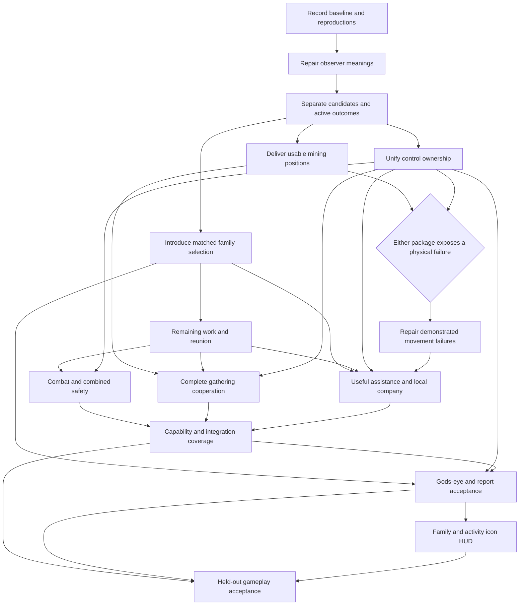

# Path 1 implementation plan — three purpose families with usable methods and observable outcomes

**Rank: first. Owner-selected direction, 12 September 2026; confidence remains conditional about eventual sufficiency.** Combine three purpose families with the candidate, destination, progress and control repairs identified by the research. Grouping is selected for clearer responsibility and extensibility; it is not a measured cure for the recorded failures. Keep the flat comparison as an experimental reference while introducing grouping separately from changed preferences and movement repairs.

The intended endpoint is the README companion: autonomous local help, coherent tool work, useful protection, safe ordinary travel, adaptable capabilities and readable behaviour. Retaining utility is a starting hypothesis. Retaining every existing factor, candidate representation or navigation abstraction is not a condition of this path.

## Implementation status, scope and reading order

Implementation navigation: [ownership](#the-implementation-has-explicit-ownership-boundaries), [target folders](#target-folders-make-purpose-families-visible-without-duplicating-execution), [migration](#migrate-current-responsibilities-once-and-remove-obsolete-paths), [data contracts](#shared-data-contracts-make-the-roadmap-implementable), [tick flow](#one-tick-resolves-one-coherent-activity-and-control-outcome), [dependency graph and packages](#dependencies-keep-behavioural-changes-attributable), [recorder and views](#recorder-gods-eye-and-hud-share-one-evidence-model), [64 failure cases](#all-64-failure-cases-have-an-implementation-owner), [27 responsibilities](#every-readme-responsibility-has-a-package-and-an-evidence-boundary), [verification](#verification-commands-exist-today-new-fixtures-join-their-owners), [rollback and first action](#change-boundaries-rollback-and-the-next-implementation-action), and [research rationale](#research-rationale-and-conditional-investigations).

**This file is the implementation plan for Proposal 1, prepared against checkout `4755e3b` on 12 September 2026. None of its implementation packages is complete merely because the plan exists.** The authorisation for this change is to write the plan in research, not execute it. Recheck the implementation revision, dirty work, affected CLAUDE chains, current policies and relevant Slate records when implementation starts. Gameplay/tool source is unchanged from the research source baseline at this writing.

Read the target contracts and folder map first, then the dependency graph and packages. The existing research rationale and conditional investigations below remain the evidence behind the plan. The [64-case failure analysis](<../Evaluation and Observability/Proposal 1 Failure Cases and Diagnostic Contracts.md>) owns each scenario, likely cause and diagnostic evidence; this file owns the work that makes those tests possible. The [acceptance matrix](<../Evaluation and Observability/Behavioural Acceptance Matrix.md>) remains the product-level oracle across all 27 responsibilities.

The deliverable is a three-family companion whose choices, physical methods and productive outcomes are connected and observable. This includes explicit reunion, risk-sensitive continuation, mining geometry, coherent survival/guard/pursuit, useful assistance, incidental actions, bounded computation, the family/activity icon HUD and matching recorder/inspector/report support. It preserves the NPC, closed authored abilities, native interaction gates, single movement writer and current independent arsenal algorithms. No family may implement its own physics or choose a separate weapon policy.

A blue level/experience bar, experience-award rules and wider profile-card redesign remain later work at the owner's direction. Movement-capability integration is in scope; unlocking actual mastery progression is a separate product dependency. Do not represent test-injected double/triple jumps as shipped mastery, or mark full progression acceptance passed while that dependency is absent. The final package reports this distinction explicitly rather than quietly reducing the expected behaviour.

## The implementation has explicit ownership boundaries

The proposed main activities are grouped as follows. This is the target implementation, not the current production chooser.

| Gathering | Combat | Nearby assistance |
|---|---|---|
| Mining ore | Hunting a worthwhile target | Lighting useful areas |
| Chopping trees | Guarding the player | Collecting nearby items |
| | | Keeping company |

Shared danger assessment and reflexes remain active across all three families. An observed dangerous projectile can warrant avoidance while mining even when no enemy is visible; the response uses an available safe movement rather than an unconditional jump. Shared companionship weighs the benefit of work away from the player against time apart and practical reunion, so optional excursions remain possible. Movement, capability limits, native permissions, hand admission, independent arsenal selection, progress attribution and lifecycle handling are shared rather than copied inside the family folders.

| Responsibility | Owner in the target design | Inputs and outputs | Forbidden shortcut |
|---|---|---|---|
| Observe the world and current capabilities | WorldObservation, using the body and existing native adapters as authorities | Immutable per-decision facts plus revision-stamped retained observations | Reading different world states during parent and child scoring without recording the change |
| Discover/refine possible work | Each family, using shared bounded query scheduling | Concrete candidate set, eligibility, unresolved coverage and physical-method evidence | Advancing an active job or applying a tool inside a score call |
| Compare activity value | BehaviourSelection shared evaluation | One factor ledger and final comparable value per candidate | Separate per-family units, duplicate distance/commitment, sum-by-number-of-children |
| Offer and select | PurposeFamilies offers; BehaviourSelection selects | Each family submits its best eligible child; parent binds that offer | Choosing an abstract combat label before discovering its available activities |
| Own active work and suspension | ActivityCoordination | Active identity, target, phase, progress and attempt lineage | A fourth “stuck” family or an unbounded resume stack |
| Choose usable working positions | PositionSelection and native interaction/attack queries | Target/body-state pairs or timed interaction windows with success predicates | A route waypoint standing in for a usable work location |
| Plan and execute movement | SharedMovementSystem, with its existing motor as sole live writer | Goal predicate, actual body state, capabilities and permitted controls; explicit attempt outcome | Behaviour/reflex writing velocity or position directly |
| Assess and execute safety responses | SharedSafety, incorporating reusable reflex queries through shared movement | Separate self/player consequence evidence, proposed motion, alternatives and viable terminal conditions | Combining both actors' danger into an automatic pull towards the player, or overriding a safe escape blindly |
| Execute permitted world changes | WorldInteractions and Inventory | Actual native edit/transfer outcome under current permission | Discovery permission authorising a later changed-world edit |
| Select immediate attacks | Weapons/Arsenal and ProjectileAiming | Current legal weapon-target evidence; actual shot identity | Pursuit target forcing every shot or incidental shots counting as pursuit progress |
| Resolve feet and hand ownership | ActivityCoordination at the existing tick boundary | Requests, grants, denial/pre-emption reasons and coherent tool ownership | Early-return paths bypassing the same resource rules |
| Explain the result | BehaviourDiagnostics, SessionReport, HeadsUpDisplay | One read-only activity snapshot and bounded evidence stream | UI rerunning decision or movement queries; logging becoming gameplay state |

Shared safety assesses and can control movement during every family. Kiting, surfacing, cover and jumping are methods; sustained escape has its own response identity and exit condition outside the family chooser. It can run with no ordinary activity. Keep-company supplies reunion or relaxed nearby movement. Shared reunion assessment scales with credible danger, expected need for help, player travel, useful alternatives and actual return cost; calm does not mean unlimited remote work.

## Self-preservation, player protection and companionship remain distinct

One shared assessment infrastructure must retain who is threatened. Direct risk to the companion, risk to the player and the consequence of being unavailable to help are different facts. Each estimate carries relevant threat identity, intended or uncertain victim, effective harm, timing, feasible intervention and confidence. Unknown targeting cannot be silently assigned to the player or counted twice as certain harm to both actors.

Shared safety evaluates consequences for the companion under proposed movements and can own its escape. Guarding evaluates achievable interventions for the player. Companionship evaluates accompanying the player's apparent activity and the cost of reunion or delayed help. Their consumers share evidence, not an undifferentiated danger score. A family label does not select a fixed distance allowance; a concrete activity's geometry, timing and consequences determine its cost.

If only the companion is threatened, change its work, movement or escape as warranted without automatically increasing the penalty for distance from the player. Its escape can indirectly alter reunion cost, but that consequence needs its own evidence. If the player is threatened, value effective help: a clear shot from across a room can be preferable to standing nearby behind a wall. Approaching is worthwhile only when it improves intervention or companionship. If both are threatened, compare feasible combined outcomes without an unconditional run-to-player rule or an unconditional abandon-player rule. An unreachable threat must not produce endless pursuit or a false successful guard merely through proximity.

P05/P08 must test four matched cases: player threatened only, companion threatened only, both threatened and neither threatened. Repeat with a distant effective shot versus a nearby blocked shot, credibly contained versus approaching enemies, changed health and altered terrain. P12 records victim-specific forecasts, direct self-risk, intervention time/status, missed-help cost and realised effects separately. A self-only threat changing the separation penalty with unchanged reunion/help evidence is a valuation defect; a correctly selected intervention with failed movement is an execution defect. These checks refine J01/J02/J15 without renumbering the existing cases.

## Player intent informs useful destinations as well as activity value

P05 must produce a revisable interpretation of recent player activity and direction with confidence, rather than using position or one frame of velocity as intent. Sustained travel, local movement while working, a brief reversal, sustained backtracking and a pause are distinguishable evidence patterns, not claims of knowing the player's future destination. The interpretation feeds every family's offers and the common position-selection boundary.

P05/P10 must connect that interpretation to candidate accompanying or reunion regions. The companion can take a different route towards useful companionship along the apparent journey, considering its own capabilities, travel time, intervening hazards, practical reconnection and uncertainty. It must not chase every historical player coordinate or sprint to a fixed velocity-extrapolated point. If a lower parallel route ends or the player changes activity, update the destination and re-evaluate the route without treating the earlier uncertain interpretation as a guaranteed plan. Existing permission and returnability rules still apply to alternate routes.

Acceptance pairs hold current player position similar while varying recent activity: sustained travel versus local torch placement, brief reversal versus sustained backtracking, and two parallel routes that reconnect versus one ending at a cliff. Include unfamiliar terrain, a player stopping to work, faster player movement and changed companion abilities. P12 records observation window, interpretation/confidence, considered meeting regions, route/return evidence and actual reunion. If interpretation is wrong, repair observation; if interpretation is right but the requested place is wrong, repair destination selection; if that place is useful but traversal fails, use P07. An intent variable alone cannot pass this requirement, and missing terrain cannot justify an omniscient rendezvous claim.

## Shared-system interactions are implementation requirements

The [sixteen interaction cases J01–J16](<../Decision Architecture/Purpose Families and Shared Companionship.md#interaction-cases-test-shared-mechanisms-rather-than-separate-patches>) are additional acceptance requirements for P02–P14, with per-case package ownership in that table. They supersede the earlier separate Survival and local-exploration children. Preserve the original S01–S05 and X01–X05 failure IDs as shared-system tests; removing a behaviour label must not remove safety or movement coverage.

**P05** must compare the consequence of separation, using likely need for help, intervention delay, credible containment, effective harm, player intent, useful nearby alternatives, uncertainty and return cost. Apply each consequence once. Neither raw enemy count nor distance alone establishes the right working envelope. Pair calm and dangerous scenes before tuning.

**P06/P08** must migrate old survival/kite/reflex responsibilities into one shared safety response lifecycle: evaluate proposed ordinary motion, adjust it where sufficient, independently generate and retain escape when needed, admit controls through the one motor boundary, and release them only after a viable resulting state or explicit replacement/failure. Threat-free drowning and an empty ordinary offer set must both work. Small tolerable harm must not become universal refusal. P03 can temporarily adapt the old selector; remove its Survival child only when this shared responsibility is present. There is no new fourth family or hidden competing combat chooser.

**P09/P10** must permit bounded pot-content collection candidates alongside known drops, using uncertain reward, native permissions, attack access, capacity and likely collection/return cost. Re-evaluate after contents appear. KeepCompany owns safe varied local motion and resting; lighting/collection own useful investigations. Do not create ExploreLocally.cs or a novelty reward. P11 invalidates these estimates when abilities or the world change.

**P12** records shared-safety owner, response goal and lifetime, interrupted activity, reason for takeover/release, expected versus actual harm, control grants and productive outcomes. Add the excursion factor provenance from J01–J16 to the common snapshot and bounded alternatives. God's Eye must distinguish useful gathering interrupted by safety from failed gathering, and successful dodging from an episode that produces no useful work.

**P13** retains family icon / health / activity icon. Subdue the suspended activity icon while shared safety owns execution; when no ordinary activity exists use a neutral icon. Detailed escape reasons stay in the inspector. **P14** includes all J01–J16 in matched and held-out acceptance; none is passed by writing this plan.

## Keep the implementation smaller than the responsibility diagram

Retain both decision levels: each family's local utility compares its own activities, then top-level utility compares the three winning offers. Share the scoring implementation and common factors between these decision-makers; do not write four duplicate evaluation libraries. Shared code does not flatten selection or remove family-specific considerations. The parent compares the submitted values without applying the same costs again. KeepCompany is an ordinary eligible offer and may beat available but low-value work, not merely a fallback after every other candidate vanishes. The matched flat result remains a test reference, not the selected production architecture.

Family grouping alone does not prevent switching: maximum-of-family-maxima selects the same winner as a flat maximum on identical candidates and factors. Stability comes from current activity continuity, remaining useful effort, real interruption/switching cost and appropriately stable observations. Include these once in the child offer so the parent sees the value of continuing. Do not add a second blanket family lock that forces poor work or delays an urgent response. If matched play still shows unjustified cross-family churn, distinguish noisy observations, candidate disappearance and mispriced switching before testing any additional family-level commitment. No such lock or removal of per-family selection is authorised by this simplification.

Use one safety-response owner. Move reusable imminent-threat query code from CombatReflexes into that boundary as implementation permits; do not leave two controllers that can each take over the body. Reuse SharedMovementSystem for response planning and execution. The response needs only current goal, interrupted activity, progress and termination evidence; it does not justify a generic scheduler or unbounded plan stack.

One active activity, one granted movement response and one coherent hand owner are sufficient starting contracts. Candidate evaluation must not mutate them. Distinguish observation, proposal, physical attempt and actual effect as data, without automatically creating four managers. Incidental interactions are proposals handled at the existing grant boundary, not another independent planner. Keep one event producer/schema feeding recorder, inspector and God's Eye. Add modules only for current responsibilities that existing cohesive code cannot own; the folder tree is a guide, not a scaffolding quota.

Retain separate native permissions, route feasibility, useful-position validation and actual effects because each can disagree in a real case. Retain ordinary continuous recovery restrictions separately from tactical escape: proximity flight permission must not leak into mining or combat. Consolidate code where appropriate without erasing those distinctions. These are scope limits for implementation, not evidence of reduced runtime cost before measurement.

## Target folders make purpose families visible without duplicating execution

This is a target map, not a statement that these files exist. New files are created when their owning package needs them; do not create empty skeleton folders. Paths named in the migration table are the current counterparts. These are responsibility names, not a requirement for one class per record or one service per concern. Use existing cohesive modules where they can carry the responsibility clearly. Proposed filenames describe responsibilities and may be consolidated where the final code is small, provided the ownership below remains explicit. Every created folder receives its applicable CLAUDE.md in the implementation change; this planning task edits no source-folder documentation.

```text
Companion/
├─ Brain/
│  ├─ CoordinateBrainTick.cs
│  ├─ BehaviourWeights.cs
│  ├─ WorldObservation/
│  │  ├─ ObservePlayerActivityContext.cs       sustained travel versus local activity
│  │  ├─ ObserveLocalOpportunityCoverage.cs    known lighting and collection coverage
│  │  └─ ReadCurrentCapabilities.cs            immutable view of actual body/tool abilities
│  ├─ BehaviourSelection/
│  │  ├─ DescribeActivityOffer.cs              candidate identity, evidence and value
│  │  ├─ EvaluateActivityValue.cs              common factors and stable tie handling
│  │  ├─ ChooseFamilyOffer.cs                  parent selection bound to an offered child
│  │  └─ ScheduleOpportunityQueries.cs         bounded retained refinement across families
│  ├─ PurposeFamilies/
│  │  ├─ Gathering/
│  │  │  ├─ OfferGatheringActivity.cs
│  │  │  ├─ MineOre.cs
│  │  │  └─ ChopTree.cs
│  │  ├─ Combat/
│  │  │  ├─ OfferCombatActivity.cs
│  │  │  ├─ ProtectPlayer.cs
│  │  │  └─ PursueAttackOpportunity.cs
│  │  └─ NearbyAssistance/
│  │     ├─ OfferNearbyAssistance.cs
│  │     ├─ LightUsefulArea.cs
│  │     ├─ CollectNearbyItems.cs
│  │     └─ KeepCompany.cs                    reunion and relaxed safe local movement
│  ├─ ActivityCoordination/
│  │  ├─ TrackActiveActivity.cs                active work, suspension and attempt lineage
│  │  ├─ DescribeActivityOutcome.cs            attempted, partial, complete, interrupted, invalid
│  │  ├─ AssessReunionCost.cs                  shared time-apart and practical reunion
│  │  ├─ AssessActivityConsequences.cs         shared risk/remaining-work comparison
│  │  ├─ GrantActivityControls.cs              one feet/hand admission boundary
│  │  ├─ ConsiderIncidentalInteractions.cs     marginal opportunities, no second movement writer
│  │  └─ RecoverDistantCompanion.cs            permitted continuous last-resort reunion
│  ├─ SharedSafety/
│  │  ├─ EvaluateSafeActivityMethods.cs        assess ordinary motion and alternatives
│  │  ├─ ChooseSafetyResponse.cs               adjustment or independently generated escape
│  │  ├─ TrackSafetyResponse.cs                sustained goal, progress and release condition
│  │  └─ ImminentThreatResponses/             migrated reusable CombatReflexes queries, no second controller
│  ├─ PositionSelection/
│  │  ├─ DescribeUsefulDestination.cs          success region or interaction window
│  │  ├─ ChooseUsefulPosition.cs               compare feasible target/pose methods
│  │  └─ FollowPlayerObjective.cs              reuse/adapt actual companionship predicate
│  ├─ SharedMovementSystem/
│  │  ├─ TerrainModel/
│  │  ├─ BodySimulation/
│  │  ├─ MovementAbilities/
│  │  ├─ RoutePlanning/
│  │  ├─ MovementExecution/
│  │  └─ TerrariaIntegration/
│  ├─ ProjectileAiming/                       existing attack feasibility authority
│  ├─ WorldInteractions/
│  │  ├─ Mining/                             native tool effect, range and exposed access
│  │  ├─ Chopping/
│  │  ├─ Torch/
│  │  ├─ Doors/
│  │  └─ WorldProtection/
│  └─ BehaviourDiagnostics/
│     ├─ PublishActivitySnapshot.cs           immutable consumer view after coordination
│     ├─ RecordBrainTelemetry.cs              extend existing continuous samples
│     ├─ RecordGodsEyeEvents.cs               extend existing causal event stream
│     ├─ BrainInspectorSamples.cs            retain actual evaluated alternatives
│     ├─ DrawBrainOverlay.cs                 family, child, method and outcome inspection
│     ├─ CaptureMovementScenario.cs          capture first violated contract with context
│     └─ ObserveTerrainChanges.cs            retain bounded native terrain evidence
├─ HeadsUpDisplay/
│  └─ CompanionHealthBar.cs                  family icon | health | activity icon
├─ Weapons/                                 algorithms retained; evidence queried
├─ CharacterBody/                           NPC lifecycle and ability authority retained
├─ Inventory/                               actual transfers and capacity
├─ PlayerIntegration/                       policies, saved state and preferences
├─ EnemyIntegration/
├─ ProfileCard/
├─ DiagnosticsConfiguration/
└─ MapIntegration/
```

Existing files omitted within retained folders remain unless their replacement is explicitly listed. This is not a deletion list. The proposed WorldObservation additions reuse existing sensing data rather than a second whole-world scan. Capability facts reference the true producers; reading them centrally does not duplicate or independently tune them.

The tools remain under Tools, outside the packaged mod. Extend existing tests where they own the question; add cohesive new files only when the new contract has no current owner:

```text
Tools/
├─ EngineReplay/
│  ├─ VerifyFamilyOffers.cs                  new selection/identity invariants
│  ├─ VerifyActivityOwnership.cs             new interruption/phase/control contracts
│  ├─ VerifyOreWork.cs                       lip, usable reach and native effects
│  ├─ VerifyHuntProgress.cs                  separate pursuit and incidental firing
│  ├─ VerifyCompanionActivities.cs           assistance, cooperation and permissions
│  ├─ VerifyResponsiveFollowing.cs           reunion and accumulated detours
│  ├─ VerifyCapturedEscape.cs                combined hazards and sustained safety
│  ├─ VerifyGodsEyeEvents.cs                 actual producer schema/identity checks
│  ├─ VerifyObservationLifecycle.cs          observer failure cannot alter behaviour
│  └─ RenderNativeInterface.cs               HUD icons and lifecycle transitions
├─ SessionReport/
│  ├─ CheckActivityOutcomes.cs               new causal joins and false-success checks
│  ├─ CheckDecisionContracts.cs              family/child offer agreement
│  ├─ CheckTheFight.cs                       correct rejection quantifiers
│  ├─ Chronicle.cs                          interruption and activity intervals
│  ├─ ChronicleTests.cs                     actual parser, legacy coverage and negatives
│  ├─ DescribeGodsEyeEvents.cs               expanded event schemas
│  └─ WritePlaytestHtml.cs                  inspect choices through actual outcomes
└─ Scenarios/                              captured/minimised terrain with provenance
```

## Migrate current responsibilities once and remove obsolete paths

| Current surface | Target and treatment | Required consumer sweep |
|---|---|---|
| Behaviours/Work/MineAction.cs and ChopAction.cs | Gathering/MineOre.cs and ChopTree.cs; preserve native tools, separate discovery from pure evaluation | Chooser registration, policy access, active-type checks, diagnostics and fixtures |
| Behaviours/Work/WorkPolicies.cs | Keep policy authority with existing per-character preferences; move its thin brain reader to the new grouping only if it remains needed | ProfileCard controls, PlayerIntegration persistence and both gathering children |
| Behaviours/Work/PerformNearbyWorldWork.cs | Split lighting intent from incidental pot decisions; keep reusable native placement/jump mechanics under existing appropriate interaction/movement owners | Torch/pot toggles, hand admission, target evidence and native interaction fixtures |
| Behaviours/Combat/HuntAction.cs | Combat/PursueAttackOpportunity.cs | All hunt target/progress readers and inspector labels |
| Behaviours/Combat/KiteAction.cs and Survival/SurviveAction.cs | SharedSafety response ownership and shared methods; preserve native escape assets | Coordinator special paths, safety tests and movement requests |
| Behaviours/Companionship/GuardAction.cs | Combat/ProtectPlayer.cs | Intervention estimates, guard retention and relevant target generation |
| Behaviours/Companionship/WalkWithPlayerAction.cs and WanderAction.cs | NearbyAssistance/KeepCompany.cs plus shared reunion considerations | Follow-specific type checks, progress watchers, recovery admission and preference labels |
| Behaviours/Companionship/RecoverDistantFollowing.cs | ActivityCoordination/RecoverDistantCompanion.cs | Lifecycle cancellation, motor flight, diagnostics and no-learning tests |
| Behaviours/Gathering/LootAction.cs | NearbyAssistance/CollectNearbyItems.cs | Capacity, retained worksite collection and independent contact pickup |
| Behaviours/CompanionAction.cs and BehaviourSelection/ChooseBehaviour.cs | Replace coupled score/execute base as required with offers, activity ownership and shared selection | Every implementation/reference, test links, coordinator API and serialized labels |
| PositionSelection/PositionRequest.cs | Evolve into purpose-aware destination contract; use one representation after migration | Every requester, positioner, navigator adapter and report producer |
| Existing recorder, overlay, HUD and report files | Extend consumers of one snapshot/event model | Schema fields, text-column declarations, early-return paths, HTML joins, config-off tests |

At each migration boundary, search the entire repository for old type names, namespace references, action-label comparisons and project-file includes. Update runtime and tests together; retained historical docs may keep old names with their dated context. Keep an old flat comparison only inside the test/reference harness once production uses families. Do not leave two selectable production brains or a default-off new brain. Save-format compatibility is separate: retain external character/world data readers where needed, but never fabricate new offer evidence from an old persisted activity name. Active runtime jobs are ephemeral by default and rediscovered after loading; the existing persistent inventory, preferences and qualified route memory keep their owners.

## Shared data contracts make the roadmap implementable

The names here are proposed domain records, not a mandate for one file per record. Keep immutable decision inputs and short-lived mutable execution state separate. Times used in scoring have declared units; engine ticks serve simulation intervals, monotonic elapsed time serves capture timing, and join metadata states how the clocks relate.

| Contract | Minimum content | Lifetime and invalidation |
|---|---|---|
| DecisionContext | Body pose/resources, player activity evidence, danger estimates, effective capabilities, policy and relevant world revisions | Snapshot per comparison; expensive derived observations carry their own evidence age |
| ActivityOffer | Stable candidate key; family/activity kind; target identity; intended outcome; eligibility; value factors; remaining effort estimate/basis; outward/return/method status; evidence revision | Refresh on relevant dependencies; selection ID is distinct from continuing activity ID |
| UsefulDestination | Purpose/target identity, allowed body-state region or timed interaction window, permission/ability requirements, outward and return evidence | Revalidate actual arrival and before interaction; approximate waypoint completion cannot satisfy it |
| ActiveActivity | Activity ID, target, current phase, retained work, current attempt ID, observed progress, suspension/end reason and last relevant revision | One active primary activity; bounded useful retained candidate context, no nested unlimited intentions |
| SafetyResponse | Response ID, hazard evidence, goal/terminal predicate, interrupted activity if any, current attempt, progress and release/replacement reason | One retained response under the common control boundary; works with no ordinary offer, ends on viable safety or explicit replacement/failure |
| AttemptOutcome | Attempt identity, actual start/end state, attempted/executed/partial/complete/invalid/interrupted/failed status, evidence and cause boundary | Historical immutable fact; interruption is never rewritten as physical failure |
| ControlGrant | Requested owner and granted owner for movement, tool/attack hand and light; denial/pre-emption reason | Per tick; coherent work ownership extends across its cooldown, with explicit interruption |
| ActivitySnapshot | Family/activity icons, phase, lifecycle/control status and IDs pointing to retained evidence | Publish coherently after resolution; consumers read without recomputation |

Eligibility must separate policy prohibition, known unusable method, unresolved method and usable method. Unknown work may generate an explicit bounded investigation offer that terminates at a safe checkpoint; it must not be presented as already proven mining. Route status, return status and interaction status are independent. Required hard permissions exclude candidates; optional risk and usefulness remain contextual costs.

Use multiplicative considerations initially where their existing semantics apply, with one documented factor ledger and numerical domain. Reject non-finite/invalid values as an explicit evaluation error rather than allowing NaN ordering. Minimum switching preference belongs once at activity level; family names add none. Use deterministic target-generation and activity-kind tie keys for matched tests. Exact curves and weights are selected from paired behavioural cases and baseline measurements in P00/P04/P05, not guessed as universal constants in this document.

## One tick resolves one coherent activity and control outcome

1. Observe the post-engine body and resolve outcomes of preceding attempts before evaluating new work. External changes and uncaptured attribution remain explicit.
2. Refresh shared world/player/capability facts and assess ongoing danger/safety-response progress independently of family offers. Invalidate only dependent candidates/methods, preserving useful target knowledge and query frontiers.
3. Handle downed/lifecycle state and ongoing permitted recovery through the same grant/snapshot publication path. These do not submit a fourth family.
4. Refine eligible opportunities under the shared query budget; families score the same context and submit their concrete best children.
5. Choose the best eligible offer. Revalidate dependencies before committing it; if invalid, allow a bounded fresh selection, then a feasible keep-company/hold/safety outcome rather than an infinite retry loop.
6. Continue, suspend, abandon or begin the active activity explicitly. Reusing the same purpose keeps its identity; a different attempt at the same purpose receives a new attempt ID.
7. Request the ordinary useful destination/method if one exists. Shared safety assesses that motion and alternatives, continues or independently generates sustained escape when required, and can suspend ordinary work. This runs even with no family offer. Grant exactly one movement controller and retain a safety response only for its current purpose and termination conditions.
8. Resolve coherent tool use, independent arsenal firing and compatible light/incidental actions. Only permitted native interactions mutate the world. A tool interruption is explicit, never inferred from an empty cooldown slot.
9. Apply the single motor packet, publish a coherent snapshot and record requested/granted controls. The next engine observation establishes physical results; same-tick native effects may be recorded immediately where genuinely observed.

Immediate safety must remain responsive even when ordinary candidate refinement exhausts its budget. Preserve cheap hazard observation and a bounded urgent-response path, with its computational allowance visible. This is scheduling and control admission, not a fixed priority ladder among voluntary jobs. If no safe response can be established, expose that limit and compare the available least-harmful options; never invent a safe landing.

## Dependencies keep behavioural changes attributable

Packages P00–P14 below are implementation milestones, not completed work. Their order is dependency order rather than a command to finish all documentation or telemetry before touching a reproducible defect. Instrumentation for each package lands with its mechanism. Multiple prerequisite arrows into an ordinary package mean all are required. The labelled diamond is an explicit OR trigger: either P04 or P06 can expose a physical failure and open P07 without waiting for the other package.



P04 and P06 can proceed on separate owned files after P02, but shared coordinator/index changes have one owner. P07 branches as soon as P04/P06 evidence identifies a physical defect; it is not delayed until optional lighting is complete. Family grouping can land without asserting a behavioural win. P03 initially groups existing evaluated candidates through adapters for the matched comparison; it does not prematurely delete old survival or follow entry paths. P06 transfers their control/recovery duties before P08 consolidates safety methods and P10 completes companionship/assistance migration. The production flat chooser is removed at P03; remaining transitional action adapters are removed by the package that assumes their responsibility. P12 is the end-to-end observer acceptance gate, not the first point at which diagnostic evidence is added.


### P00 — Establish the measured starting point

**Prerequisites:** None; first implementation session.

Read current revision and policies, refresh source findings, and record baseline fixture/report outcomes before changing behaviour. Identify the existing ore/pot stall and arrived-without-shot captures by their recorded build and coverage. Prepare the owner's raised-lip scene as an explicitly new reproduction with lip present/removed, mirrored terrain and varied effective reach. Fix variables one at a time; write initial acceptance thresholds before seeing changed results.

**Owned implementation surface:** Existing EngineReplay ore/firing/follow/escape fixtures, SessionReport, Scenarios and research evidence. No source rename in this package.

**Acceptance and instrumentation:** Record a full-brain baseline; a held activity with ordinary control interruptions; and a held native-valid destination. Include tool outcome, not merely mining label. Record CPU distributions and observation-on/off cost on the same scenario.

**Branch on the result:** If held activity succeeds, investigate selection/continuation. If only the valid destination succeeds, P04. If the valid destination cannot execute, P07. If no original-signature reproduction is available, keep that attribution open and use a newly identified fixture only for the claim it proves.

**Coverage and exit:** E01–E02; all later comparisons inherit this baseline. Completion: reproducible inputs, result files, source/config identity and explicit missing evidence.

### P01 — Make the observer distinguish attempts from results

**Prerequisites:** P00.

Correct CheckTheFight's mixed weapon rejection quantifier and Chronicle's reflex-control spelling against actual producer values. Add genuinely fresh chooser and activity/attempt correlation events across ordinary and early-return paths. Extend real native tool/transfer observation to report attempts, observed effects and unknown attribution. Keep old recordings readable with missing coverage declared.

**Owned implementation surface:** RecordGodsEyeEvents, RecordBrainTelemetry, native effect observers, CheckTheFight, Chronicle, Session parsers and actual-writer tests.

**Acceptance and instrumentation:** A blocked bow plus an out-of-range knife must not become 'all attacks outside reach'. A reflex-owned interval must not be ordinary travel failure. A native call producing no tile change cannot become completed work. Missing fields skip the affected check explicitly.

**Branch on the result:** If readers disagree on the same event, repair schema/join semantics before tuning the actor. If native attribution is unavailable, record unknown and test a narrower outcome rather than infer the actor from proximity.

**Coverage and exit:** E01; all 64 cases require these identities. Completion: positive and negative reader fixtures using actual producer output; no assumed post-state.

### P02 — Separate candidates, activity ownership and physical attempts

**Prerequisites:** P01.

Introduce the proposed offer/outcome records and move discovery/cache updates out of score evaluation. Adapt current actions first without changing their preferences. Give active work one owner and a bounded suspension record; use activity identity for purpose and attempt identity for each physical method. Express termination reasons and permission failures. Keep local activity execution inside its owner, avoiding a universal command language.

**Owned implementation surface:** BehaviourSelection, current Behaviours adapters, ActivityCoordination, coordinator and diagnostics. Adapters are transitional and removed at migration, not a permanent second framework.

**Acceptance and instrumentation:** Repeated evaluation of the same immutable context must return the same offers without changing work. Interrupted movement cannot count as work failure. External ore removal changes remaining work but not companion production. Despawned targets cannot retain valid offers.

**Branch on the result:** If pure evaluation changes choices, identify hidden state/order dependence before P03. If all activity authors repeatedly need shared abort/phase machinery beyond this small owner, compare Path 2 with the same offers; do not silently build it here.

**Coverage and exit:** E03–E05; T02/T05/T09, M03/M05, W03, H02/H03, I04. Completion: migrated contract usable by current activities and real diagnostics.

### P03 — Introduce the three purpose families with matched selection

**Prerequisites:** P02.

Create family folders and local offer builders. Parent selects the highest-valued eligible child offer across the three families; child and parent share evaluation machinery. Migrate registration and expose unknown/no-offer/valid states. Keep a flat reference in tests. Revalidate before activation with bounded reconsideration. Preserve actual keep-company movement even when no optional work is available.

**Owned implementation surface:** PurposeFamilies, BehaviourSelection, coordinator, all type/label consumers and VerifyFamilyOffers.

**Acceptance and instrumentation:** On identical candidates, factors and tie rules, flat and grouped selection must pick the same candidate. Duplicate/reorder candidates, empty a family, invalidate a target between offer and use, and exhaust one family's query budget. No absent offer can win.

**Branch on the result:** If equivalent inputs yield different winners, inspect aggregation, duplicate factors or mutation. If hierarchy hides worthwhile children, repair coverage before tuning. If grouping provides no maintainability benefit after matching behaviour, retain contracts and reconsider runtime hierarchy.

**Coverage and exit:** E04; T01/T03/T04/T07/T08/T09/T10, G01/G03, A01. Completion: production family selection enabled, old production selector removed, tests preserve reference only.

### P04 — Make mining choose a usable ore and working position

**Prerequisites:** P02; may run alongside P03.

Refactor ore discovery to return candidate identity and unresolved approach evidence instead of rediscovering an unrelated unknown ore. Evaluate current-body reachable ore before travel, then compare usable nearby tile/body-position pairs. Account for effective tool reach, exposed access, tool power and permissions. Align movement termination tolerance with the success region. Support timed interaction methods through the existing movement proof boundary; verify actual use and landing.

**Owned implementation surface:** OreFinder, TileMiner, MineOre/current MineAction, PositionSelection, interaction-jump boundary and VerifyOreWork.

**Acceptance and instrumentation:** Run the raised-lip pair, a blocked nearest ore with an exposed farther one, valid mining near maximum reach, different body arrival offsets, ceiling interaction, changing tool power and player-altered terrain. Native work must occur or the first failed predicate must be reported; standing still while successful is not a stall.

**Branch on the result:** If supplied valid tile/pose works, broaden/rank candidate coverage. If the delivered pose differs, P07. If a native-valid pose cannot work, inspect tool admission/integration. If occlusion incorrectly refuses a valid exposed face, compare native geometry and policy before weakening visibility globally. Never excavate ordinary terrain to hide the defect.

**Coverage and exit:** E02/E07–E10; M01–M05, G01. Completion: actual work from delivered poses with native effect evidence, including rejection countercases.

### P05 — Compare remaining work with practical reunion

**Prerequisites:** P03; consume P02 progress and current movement estimates.

Centralise player motion/local-activity context, shared reunion cost and accumulated time apart. Estimate remaining work from native tool/effect information where available and expose uncertainty otherwise. Compare the next useful completion against returning now; completing a block does not automatically commit the rest of a newly exposed vein. Apply factors once across all optional activities and keep-company. Use elapsed separation independent of label switches.

**Owned implementation surface:** WorldObservation, AssessReunionCost, AssessActivityConsequences, EvaluateActivityValue, activity estimates and responsive-follow tests.

**Acceptance and instrumentation:** Pair just-started versus one-hit-left work with stationary versus departing player, easy versus awkward return, and repeated short detours. Equal remaining work receives equal treatment regardless of who produced earlier progress. A short turn cannot create a wholly new travel intention by itself.

**Branch on the result:** If estimates are wrong, improve the observation/model. If estimates are right but choices wrong, adjust the explicit trade-off using paired scenes. If remaining work wins forever, remove unbounded commitment rather than add per-job abandonment timers. If behaviour feels wrong despite passing invariants, use owner judgement on captured pairs.

**Coverage and exit:** E03/E14; T05/T06, G02/G03, A03, W04, H04, K02/K05, X05. Completion: quick justified work and prompt warranted reunion both demonstrated.

The actor-specific safety/protection and intent-to-destination acceptance sections above are mandatory parts of P05, exercised jointly with P08/P10 and observed through P12. They are not optional polish after following works by position alone.

### P06 — Give movement and the hand one admission boundary

**Prerequisites:** P02; before removing old survival/recovery branches.

Implement per-tick requested/granted control ownership with coherent work phases spanning cooldown gaps. Route ordinary work, reflex, recovery and downing through common finalisation so snapshots and hand rules do not depend on early returns. Keep immediate arsenal selection independent. Move distant-return recovery admission from the old follow type check to explicit reunion need under existing restrictions. Contact pickup and available light remain compatible where permitted.

**Owned implementation surface:** GrantActivityControls, TrackActiveActivity, RecoverDistantCompanion, coordinator, motor boundary and lifecycle/recovery tests.

**Acceptance and instrumentation:** Travel can shoot; coherent pick/axe work cannot weave shots between swings; a real interrupt ends tool ownership; torch light can yield to a shot. Downing/cancellation inside terrain preserves safe recovery clearance. Exactly one movement packet is applied. Recording disabled changes no grants.

**Branch on the result:** If tool rights depend on family labels, repair phase ownership. If recovery becomes available to resource travel, correct admission. If bypassed finalisation leaves stale state, unify finalisation rather than duplicate it in each branch.

**Coverage and exit:** E05; T02/T10, S05, K04, plus all hand/lifecycle regressions. Completion: every coordinator exit has explicit grants and a truthful snapshot.

### P07 — Repair navigation only at the failing contract

**Prerequisites:** P04 or P06 evidence plus P00 baseline.

Classify a failed physical method into absent transition, unfinished search, invalid actual entry, native mismatch, unusable terminal state or pre-emption. Preserve outward/return distinction. Reuse retained frontier and directed experience where valid; invalidate by relevant terrain/capability/entry changes. Local unstick is a different method for the same purpose; failed methods are scoped and reusable only when conditions change.

**Owned implementation surface:** SharedMovementSystem query/planning/execution/adapter owners, PositionSelection and native movement fixtures. Preserve the sole motor writer.

**Acceptance and instrumentation:** Native-valid held goal must be delivered or produce the correct explicit failure. Test required away-first detours, lip/ledge entry, resource-consuming return, no-progress oscillation, timeout and interrupted traversal. Score physical completion separately from voluntary cancellation.

**Branch on the result:** Missing legal transitions require representation/generation repair. Budget-only failure requires retained/refined computation. Repeated sparse graph changes may justify D* Lite comparison on the same graph. Native mismatch requires adapter/control repair. If coarse state merges incompatible resource/velocity states despite economical local proof, compare richer state; never replace A* solely because the companion looked stuck.

**Coverage and exit:** E07–E11; M01/M04, W01, H01, S04/S05, L05, I03, K01/K03, X02/X03. Completion: each changed physical claim has native evidence and explicit coverage limits.

### P08 — Combine safety methods and make combat purposeful

**Prerequisites:** P03/P05/P06; use P07 methods as required.

Move kite, survival and reflex response ownership into shared safety, integrating breath, damage, resource and aftermath costs. ProtectPlayer evaluates useful intervention rather than player proximity. PursueAttackOpportunity uses actual reachable attack evidence and retains target-generation identity. Share arsenal feasibility through the existing boundary without changing its ranking algorithms. Record pursuit target, aiming target and actual hit target independently.

**Owned implementation surface:** Combat, SharedSafety, CombatReflexes, consequence estimates, position queries, existing Arsenal query boundary and combat/escape tests.

**Acceptance and instrumentation:** Pair hidden5%-health and visible100%-health enemies with cheap versus costly reposition, urgent versus irrelevant threat and changing visibility. Test guarding past an intervening hostile, surfacing under projectile pressure and attacks while retreating. Incidental shots cannot perpetually renew a failed pursuit; successful safety requires a usable aftermath.

**Branch on the result:** If damage prediction is poor, improve observation/calibration. If intervention estimates are right but delivered late, inspect approach and grants. If safer single ticks worsen drowning, strengthen terminal consequences. If current-value comparison misses an actual enabling sequence, compare Path 3 locally; do not encode a forced kill order.

**Coverage and exit:** E05–E08; C01–C03, H01–H05, P01–P05, S01–S05. Completion: combat changes shown as paired outcomes, not a generic 'less damage' headline.

### P09 — Finish gathering cooperation and truthful completion

**Prerequisites:** P04/P05/P06.

Apply native usable-position and outcome contracts to chopping; prefer separate active trunks while permitting shared ore veins. Revalidate permissions at mutation and targets after external changes. Distinguish completed reachable portion, remaining unknown portion and fully completed work. Collection after work remains a separate opportunity with its own route/capacity/return cost. Preserve Off/Mimic/Auto semantics and defaults through migration.

**Owned implementation surface:** Gathering, Chopping/Mining/WorldProtection, preferences, inventory observation and activity/native ore fixtures.

**Acceptance and instrumentation:** Test external player work, switching active trees, changing protection after approach, cancelled work and ore drops falling out of reach. Verify no extra non-ore excavation and no phantom completed work. Run policy toggles during each activity phase.

**Branch on the result:** If broad reservations suppress cooperation, narrow to actual working space and trunk preference. If native effects cannot attribute the actor, mark unknown. If pruning becomes completion, fix outcome representation rather than inflate progress.

**Coverage and exit:** E03/E07/E15; G01–G03, M05, W01–W05, I03. Completion: gathering output and permission coverage with equal remaining-work treatment.

### P10 — Make assistance useful without endless detours

**Prerequisites:** P03/P05/P06 and required P07 movement guarantees.

Implement spatial lighting opportunities with measured/unknown coverage; separate held light from persistent placement. Implement collection from actual quantities/capacity. Keep-company provides relaxed safe local movement or rest; observation coverage supports lighting and collecting without an independent exploration activity. Pot-content collection trips and incidental pots/contact pickup/light use marginal added cost, deduplicate benefits and never write competing movement. A detour needing a new destination is a proposed method/activity change through the same grants.

**Owned implementation surface:** NearbyAssistance, local opportunity observation, ConsiderIncidentalInteractions, native Torch, Inventory, MapIntegration evidence and activity/follow tests.

**Acceptance and instrumentation:** Test last torch exhausted, player-held light, overlap between placements, moved drops, partial stack capacity, shared contact pickup, darkness below an unreturnable ledge, empty world reunion and purposeless repetitive movement. Verify unknown lighting coverage is not treated as measured darkness.

**Branch on the result:** If opportunities are missing, improve coverage. If captured opportunities lose incorrectly, inspect values. If repeated cheap detours dominate, fix cumulative journey cost. If accurate local choices miss useful sequences, E13 tests bounded planning before introducing a general task chain.

**Coverage and exit:** E12–E15; A01–A03, L01–L05, I01–I05, K01–K05, X01–X05. Completion: actual useful assistance and restrained detours, not a fixed torch/pot/loot order.

### P11 — Validate capabilities, native boundaries and wider product behaviour

**Prerequisites:** P07/P08/P09/P10.

Use one current capability revision across tools, offers, movement proof, execution, threat cost and route memory. Verify current player-derived changes and exercise available ability implementations through the same surface. If an expected double/triple jump, dash or swim method is absent, record a distinct ability implementation dependency: define its resource transition, native execution and tests before admitting it to offers. Preserve lifecycle, closed world edits, doors, cargo, home protection, courtesy and encounter-context behaviour.

**Owned implementation surface:** Capability producers/WorldObservation view, MovementAbilities/native adapter, PlayerIntegration policies, family consumers, Inventory, WorldProtection and native fixtures.

**Acceptance and instrumentation:** Run increase/decrease changes to speed, reach, tool power and defence during active jobs; test supported movement resource changes and invalidation. Exercise modded power/permission gates within actual loader support. Test player death, downing, return, doors, crowding, ordinary combat and supported boss/event context.

**Branch on the result:** If only some consumers update, complete dependency propagation. If native integration rejects content, fix the adapter or expose unsupported coverage, not an enemy-name policy. If a future ability/progression is unavailable, do not fabricate a live pass from a test injection. Boss/event facts unavailable from a mod remain explicit fallback limits.

**Coverage and exit:** E15–E16 and all27 acceptance rows. Completion: capability contracts and current-kit acceptance; separately list unbuilt ability/progression dependencies and their required native proofs.

### P12 — Make God's eye explain a full decision-to-effect interval

**Prerequisites:** P01 evidence grows throughout; final integration after P11.

Finish the schema, coverage census, inspector and reports specified below. Join by session/decision/activity/attempt/target generation, not row adjacency or nearest timestamp alone. Draw actual reach, working region, destination and control evidence from retained solver results. Keep unknown candidates and dropped events visible. Classify objective contradictions separately from heuristic oddities.

**Owned implementation surface:** BehaviourDiagnostics, SessionReport readers/checks/HTML, actual-producer native tests and diagnostics config.

**Acceptance and instrumentation:** Select one unproductive interval in each family and follow offer to native outcome without rerunning solvers in UI. Feed old, partial, malformed, interrupted and reused-ID sessions. Prove recording-off preserves brain decisions and output. Measure recording/inspection cost and retention bounds.

**Branch on the result:** If the report cannot identify the first failed contract, add the missing evidence at its owner. If an alert fires on correct stationary work, detours or unrelated damage, fix the alert semantics. If memory/CPU grows, bound retention/aggregation without concealing lost coverage.

**Coverage and exit:** E01/E12/E16, all64 cases. Completion: observed end-to-end explanations, not merely added columns.

### P13 — Display family and activity icons around health

**Prerequisites:** P03/P06/P12 snapshots; after behaviour semantics are stable.

Reconcile the superseded AIC-138 HUD wording when implementation scope permits board upkeep. Prepare the small icon arrangement for review, then update the existing native health notch: family icon left, health middle, behaviour icon right. Do not put weapon/ore/method details on this surface. Use one published snapshot and explicit downed/recovery/suspended display semantics. Preserve click, drag and profile-card access.

**Owned implementation surface:** HeadsUpDisplay/CompanionHealthBar, read-only ActivitySnapshot, existing native UI render/input fixture and localisation where needed.

**Acceptance and instrumentation:** Render every family/activity pair, transitions, downing/recovery, small viewports and UI scales. Check icon distinguishability, alignment, health text, input capture and no extra item use on opening. Inspect the actual render; a nonempty screenshot alone is insufficient.

**Branch on the result:** If icon semantics are ambiguous, adjust art/tooltip mapping without changing the brain. If state is stale, repair snapshot publication. Blue XP bar and larger card refinement remain deferred and cannot block completion of this requested icon change.

**Coverage and exit:** HUD requirement and E15–E16. Completion: native offscreen geometry/input evidence plus owner visual review; no fabricated progression UI.

### P14 — Judge the complete behaviour and stop adding architecture

**Prerequisites:** P11/P12/P13; evidence from every earlier package.

Run the held-out acceptance matrix across ordinary movement, work, assistance, combat, changed terrain and supported capability states. Inspect per-case outcomes and costs, not only averages. Record the chosen thresholds and scenarios, baseline/current revisions, remaining limitations and owner judgement. Remove transitional adapters, old production registrations and stale docs within the authorised implementation surface.

**Owned implementation surface:** All changed source/documentation consumers; existing verification command, native suite, captured cases, SessionReport and recorded play.

**Acceptance and instrumentation:** All64 prospective case IDs receive evidence or an explicit not-exercised/dependency disposition; all27 product responsibilities receive current-kit, native, live and progression coverage separately. Code contracts can pass before gameplay feels right. No unknown or skipped suite becomes green.

**Branch on the result:** If choice is bad with correct observations/methods, revisit valuation. If lifecycle duplication persists, Path2 comparison. If enabling consequences remain missed, Path3 comparison. If physics fails, return to P07. If only UI polish/progression remains, keep that separate instead of reopening the brain. Two failed repairs of one signature trigger a new causal investigation.

**Coverage and exit:** E16 and complete acceptance matrix, including J01–J16 and their actor-specific danger and intent-to-destination refinements. Completion: measured bounded acceptance, the source-verified README write-out below and a candid unresolved ledger, never universal Terraria correctness.

## Implementation completion includes a plain-language README of the actual system

After implementing Proposal 1, P14 must update the root README's System In Place section from the resulting code. Describe current reality in present tense, without before/after tables, a simplification narrative or a change log. Keep documentation truthful at intermediate implementation boundaries too; the final rewrite is a completion requirement, not permission to describe unbuilt work as current now.

The README must include these four connected explanations:

1. **The actual tick flow in simple language.** Explain observing the world and previous outcomes; interpreting player activity and separate risks to each actor; preparing concrete opportunities; each family's local utility nominating its best action; top-level utility comparing those offers; retaining or changing the current activity; selecting a useful destination and feasible movement; shared safety adjusting or temporarily owning movement; resolving hand use and compatible independent attacks; applying controls and observing actual results. Verify the precise order, lifecycle exceptions and retained work against the implemented coordinator. A logical explanation must not imply that every expensive query is recomputed every tick or that an abstract family is picked before its child is known.
2. **A simple family/behaviour table.** Gathering: Mining and Chopping. Combat: Hunting and Guarding. Nearby assistance: Lighting, Collecting and Keeping company. Explain the actual implemented membership; if implementation intentionally departs from this plan, reconcile the decision and documentation rather than silently showing the planned table.
3. **What each behaviour is trying to accomplish.** Explain useful ore/tool access; suitable tree work; worthwhile attack positioning; achievable player protection; useful light; attainable items or uncertain pot contents; and accompanying/rejoining or relaxing around the player. Keeping company is a genuine offer that can beat low-value alternatives. State observed limitations without presenting temporary shortcomings as desired behaviour.
4. **Shared responsibilities and their effects on every behaviour.** Explain world/player observation and intent; actor-specific danger and intervention; contextual companionship; safety adjustment and sustained escape; position/movement and current abilities; tool/world permissions; continuity and actual progress; movement/hand ownership; independent arsenal choice; incidental interactions; lifecycle/recovery; and diagnostics. Group the explanation for readability without inventing a manager for every responsibility. Include the projectile-during-mining and distant-effective-guard examples to show how the shared parts interact with a chosen activity.

The README must explicitly distinguish a route, a usable interaction position and an observed productive effect. Its explanation of intent must include moving with the player's apparent journey through a different feasible route, with uncertainty and changed intent handled honestly. Its safety explanation must distinguish self-preservation from player protection; distance is not a universal proxy for either. Describe the implemented family-icon / health / behaviour-icon HUD and how temporary safety ownership is represented, without adding the deferred XP/profile features.

Preserve the README's evidence boundaries. Expected Behaviour and its table cells remain implementation-independent product requirements. Current Behaviour remains grounded in named recordings, with unexercised situations stated as such. System In Place and system table cells are verified against source. Reconcile affected diagrams, folder references and responsibility rows with their actual owners; retain useful detail alongside the new plain-language explanation. No unsupported claim of live improvement may be inferred from code or a successful build.

Acceptance for this documentation step requires reading the final coordinator, family registrations, shared safety/control boundary, observation/position contracts and HUD snapshot consumers, then checking every sentence and diagram against that code. Use recorded evidence for gameplay claims and explicit scope for fixture results. A clean link check alone does not prove the explanation. Missing prose, stale eleven-action descriptions presented as current, omitted shared player intent, or a planned feature presented as implemented keeps P14 incomplete. Record the verified implementation revision and unresolved evidence limits in the completion record; history belongs in git, not in the README's system explanation.

## Recorder, God's eye and HUD share one evidence model

Extend the existing versioned TSV and JSONL writers; do not add another autonomous recorder. The proposed field names below are a schema design to settle in P01, not fields already present in older captures. Keep old raw fields readable where they mean something different, and explicitly mark new unavailable fields when reading legacy runs.

| Record or view | Producer and proposed fields | Consumer and correctness condition |
|---|---|---|
| Session provenance | Existing session writer: source revision, package/build identity where available, game/loader/mod versions, policy/config identity, capability identity, schemas, clock relationship and normal closure | SessionReport refuses cross-run joins; missing provenance reduces reproducibility rather than silently filling from the current checkout |
| Decision evaluation | Selector: decision_id, context_revision, evaluation_tick, offered family/activity/target IDs, raw/final value, named factors, eligibility, examined/deferred counts and per-family query cost | Inspector shows actual evaluated alternatives, not hypothetical reruns; parent winner references an actual offer |
| Activity transition | Activity owner: activity_id, previous/new phase, target_generation, attempt_id, remaining_work and estimate_basis, suspension/end reason | Chronicle joins continuity without counting retained labels as fresh decisions or every suspended tick as a failure |
| Physical method | Position/movement owners: purpose_id, destination_revision, target/face, success region or window, actual entry pose/resources, outward_status, return_status, search_stop, terminal_status | Draw actual reach and arrival; route found, usable arrival and fulfilled activity remain separate |
| Control grant | Coordinator: requested/granted movement_owner and hand_owner, denied_reason, preempted_attempt_id, capability_revision | Any overlap or skipped finalisation is attributable; unrelated reflex control cannot be charged to work |
| Native effect | Interaction/native hooks: attempt_id where causal link is available, target generation or tile revision, action_requested, action_admitted, effect_observed, quantity/damage, actor_attribution | Attempt is not progress; unknown cause remains unknown; external tile removal changes remaining work without earning companion output |
| Combat relation | Existing arsenal plus activity owner: pursuit_target, aim_target, projectile_generation, intended_hit, actual_hit, forecast_age | Incidental attack value is visible without falsely advancing pursuit; actual damage stays distinct from projected prevention |
| Shared context | Observation/value owners: player_motion_window, activity_context, confidence/basis, candidate reunion regions, time_apart, remaining_time_estimate, reunion_time/status, threat victim identity/uncertainty, self-risk, player-risk, intervention_time/status, missed-help cost and resource forecasts | Compare changed circumstances across continuation and destination choices; preserve actor-specific evidence even when comparing combined outcomes; screen edge is not the policy boundary |
| Coverage/performance | Writers and query scheduler: samples/events retained or dropped, malformed/missing sidecars, buffer occupancy, evaluation/refinement/recording cost and stale evidence age | Reports cannot equate no finding with no failure when coverage is absent; display cost does not disappear inside chooser cost |
| HUD snapshot | Coordinator publishes coherent family/activity IDs and lifecycle state; HUD maps to icons | Family icon left, health centre, activity icon right; detailed execution belongs to inspector, not a method field on HUD |

Activity state is gameplay-owned even when recording is disabled. Consumers can drop visual samples but cannot invalidate movement state, query caches or active jobs. Recorder exceptions disable/report the affected stream and release its resources; they must not change the companion's choice. UI drawing never calls an expensive solver. A bounded recording window should keep pre-failure context and a limited aftermath; pressure on its storage must be observable as lost coverage.

The inspector needs four connected views: family/child offers; purpose and working geometry; requested versus granted control; actual effects and termination. Selecting an activity highlights its target and current method. Selecting a shot highlights its independent aiming/hit chain. Terrain unavailable at the relevant time remains blank/unknown rather than borrowed from the present world. A tool-reach outline depicts the real effective predicate, including invalid exposed access, rather than a misleading decorative circle.

SessionReport adds threshold-free contradiction checks for selected absent offer, inconsistent identity/revision, incompatible grants, false completed transfer and claimed purpose arrival outside its declared success region. Longer unproductive intervals remain diagnostic hypotheses unless the record proves a contract violation. A damage event after a dodge is not automatically proof that the dodge was irrational. The existing source-folder prose sometimes describes detectors more strongly; update those owners when implementing the corrected semantics rather than inheriting the old claim.

## All 64 failure cases have an implementation owner

This table is a traceability index, not a second scenario definition. P01/P12 provide evidence for every row; the listed packages own the behavioural correction and its discriminating tests. An implementation ledger adds actual test names, revisions, outputs and status to these entries as work lands.

| Failure IDs | Owning package(s) | Required observable distinction |
|---|---|---|
| T01, T07 | P03 | Empty/duplicate family offers cannot change admission or matched ranking |
| T02 | P02/P06 | Physical failure versus pre-emption of useful work |
| T03, T04 | P03/P08 | Enemy presence versus consequential threat and effective protection |
| T05 | P02/P05 | Stable continuation versus forced persistence |
| T06 | P05 | Cheap remaining work versus worsening practical reunion |
| T08 | P03/P10 | Rejected alternatives versus alternatives starved of computation |
| T09 | P02/P11 | Valid evidence versus stale world/ability/target assumptions |
| T10 | P03/P06 | No optional work versus no actual reunion movement |
| G01 | P03/P04/P09 | Nearby but ineligible ore versus usable gathering alternatives |
| G02, G03 | P05/P09 | Remembered work versus best current work on a shared scale |
| C01, C02, C03 | P08 | Useful safe intervention versus naive approach, single-hazard dodge or forced pursuit |
| A01, A02, A03 | P05/P10 | Contextual assistance, unique benefits and cumulative journey cost |
| M01, M02, M03, M04 | P04/P07 | Usable tile/pose, real effect and correctly timed delivery |
| M05 | P02/P09 | Reduced remaining work versus actor-attributed output |
| W01, W02, W03, W04, W05 | P09/P05 | Axe feasibility, cooperation, attribution, continuation and edit permission |
| H01, H02, H03, H04, H05 | P08/P07 | Usable attack position, purpose-specific progress and valid target identity |
| P01, P02, P03, P04, P05 | P08 | Intervention rather than proximity, realistic timing and non-fabricated prevention |
| S01, S02, S03, S04, S05 | P08/P06/P07 | Combined lasting safety, useful activity and actual control ownership |
| L01, L02, L03, L04, L05 | P10/P07 | Known lighting, native placement, marginal persistence and safe return |
| I01, I02, I03, I04, I05 | P10/P09 | Actual quantities, changing identity and independently feasible collection |
| K01, K02, K03, K04, K05 | P05/P06/P07/P10 | Practical reunion, intent uncertainty, real detours and permitted recovery |
| X01, X02, X03, X04, X05 | P10/P07 | New useful coverage versus walking, stale memory or unsupported excursions |

The full 27-responsibility acceptance matrix additionally covers existing responsibilities that must survive the migration: native doors, inventory, home protection, downing/revival, map reveal, player-facing controls and encounter conduct. P11/P14 own that regression surface even where it has no new family child. The health HUD is P13. Blue experience UI, experience economics and full mastery unlocking remain explicit later dependencies rather than covert additions to P13.

### Every README responsibility has a package and an evidence boundary

The IDs in this table belong to the product acceptance matrix, not the similarly named family-failure IDs above. P14 checks the whole table; the listed packages own the implementation and focused evidence.

| Product case | Responsibility | Implementation owner and required boundary |
|---|---|---|
| A01 | Move out of the player's way | P05/P10/P11: observe actual placement or passage interference; compare alternate positions without treating every cursor movement as a command |
| A02 | Boss and event behaviour | P08/P11: supported encounter facts affect shared danger, optional work and movement; unfamiliar event recognition remains explicit |
| A03 | Read player direction | P05: sustained travel versus local activity and brief reversals |
| A04 | Enemy selection | P08: separate current shot, pursuit opportunity and hazard membership |
| A05 | Chain useful work along a trip | P10: marginal incidental work with cumulative detour cost; E13 planning experiment only if delayed enabling effects matter |
| A06 | Know what is unavailable | P03/P07: unknown, policy-forbidden and model-exhausted differ; world changes reopen evidence |
| A07 | Commit coherently | P02/P05/P06: remaining effort and actual output, with interruptible work |
| A08 | Find a firing position | P07/P08: actual arrival enables the intended trajectory |
| A09 | Preserve itself | P06/P08: sustained safe outcome under real breath and damage |
| A10 | Light useful areas | P10: native placement, additional coverage, supply and return proof |
| A11 | Recognise threats | P08/P11: damageability does not determine hazard membership; unfamiliar scripts remain uncertain |
| A12 | Traverse terrain | P07: actual entry, native motion and viable terminal state |
| A13 | Protect the player | P08: useful timely intervention, not proximity or fabricated prevented damage |
| A14 | Break containers incidentally | P06/P10: native permitted hit on a worthwhile journey, no destination-seeking pot job |
| A15 | Dodge and kite | P06/P08: one movement grant, combined aftermath and compatible shooting |
| A16 | Mine opportunistically | P04/P05/P09: usable tile/pose, full effective reach and actual work |
| A17 | Report its activity | P01/P12/P13: truthful phase in inspector and coherent family/activity icons on HUD |
| A18 | Find routes | P07: distinguish representation, search work, memory validity and execution |
| A19 | Keep company | P05/P07/P10: practical reunion, terrain disadvantage and valid away-first detours |
| A20 | Collect items | P09/P10: real quantities, capacity, changing drops and independently valued retrieval |
| A21 | Select weapons | P06/P08/P11: preserve arsenal ranking, legal shots and native effects through new control admission |
| A22 | Recover when reunion is unavailable | P06/P07/P10: remain useful locally and admit only permitted continuous reunion recovery |
| A23 | Respect world-edit boundaries | P04/P09/P10/P11: native mutation permission checked at use, including home protection |
| A24 | Use movement abilities | P07/P11: resource transitions and native execution before admission; mastery unlocks remain a separate dependency |
| A25 | Handle doors | P07/P11: native openability, collision and revision invalidation agree |
| A26 | Get up after downing | P06/P11: NPC-owned lifecycle and safe cleared controls through interruption/revival |
| A27 | Chop opportunistically | P05/P09: usable trunk, cooperation and independently valued drops |

For A01, P11 adds actual interference evidence from the existing player input/body observation, proposes alternate useful body positions through PositionSelection, and prices courtesy against immediate safety and work. A glance at the companion while holding a weapon is the negative case; a placement or passage obstruction is the positive case. No separate courtesy movement writer is introduced.

For A02, P11 reads supported native boss/event state alongside observed pressure and applies the context to existing offers, safety methods and positioning. Tests distinguish a recognised encounter from ordinary cave danger and an unfamiliar mod event. Failure to recognise an event directs work to observation/integration; correct context with distracting optional work directs work to valuation. The implementation must not create a new boss controller merely to avoid testing the shared combat family.

For A24, every missing movement method follows the same implementation sequence within its explicit ability dependency: define initiation and resource consumption/replenishment in MovementAbilities; implement the real motor/native effect; expose the method to local proof and route transition generation; invalidate affected evidence on gain/loss; then test standalone, chained and return-dependent use from varied actual states. Only after those checks may an offer rely on the method. A mastery UI unlock, its cost and XP progression are separate from making an already-authorised physical method usable. If those dependencies are not built, the plan reports the corresponding acceptance row incomplete rather than relabelling current-kit success as the full expected behaviour.

## Verification commands exist today; new fixtures join their owners

Run from the repository root after the relevant implementation package. These commands were inspected for this plan, not executed during planning. A targeted suite should be followed by the existing aggregate verification at a coherent integration boundary; do not repeatedly rerun unchanged heavy suites without new evidence.

```sh
dotnet run --project Tools/SessionReport -- --self-test
dotnet run --project Tools/EngineReplay -- --ore-work
dotnet run --project Tools/EngineReplay -- --follow
dotnet run --project Tools/EngineReplay -- --protection-recovery
dotnet run --project Tools/EngineReplay -- --escape
dotnet run --project Tools/EngineReplay -- --observation
sh Tools/verify.sh
```

SessionReport self-tests exercise parser/report claims, not the brain. EngineReplay uses native integration under its documented fixture limitations; it is not a full live world simulation. The aggregate command builds without packaging, verifies the navigation boundary and runs portable contracts, reader tests and native checks. Its exit 2 means a check could not run, not acceptance; exit 1 is failure, and exit 0 requires all requested checks.

Add new family/ownership fixtures to the existing EngineReplay default suite and any narrow entry points only when implemented. Do not put an imaginary `--family-offers` command into the operating instructions now. The new report checks belong in the actual registered reader path and declare every required column, including fields used only to explain a finding.

For the existing offscreen UI route, use the EngineReplay operating manual's installed-library setup and `--render-ui`; P13 must extend the real rendered HUD surface rather than assume the current card screenshots cover it. No visible game launch is an automatic test step. A recorded playtest happens at the owner's checkpoint; choose packaging/launch timing explicitly rather than interrupt an active game with reload.

Before each behavioural change, define what would count as a pass and a falsifier. At minimum, contract invariants are exact; performance compares the same scenarios and installed kit; qualitative decisions use paired scenes and then owner judgement. Report selection frequency, productive work, unwanted separation, damage, interrupted versus failed movement, candidate starvation and cost distributions together. Lower damage with no useful work is not success, nor is higher ore throughput at the cost of abandoning the player.

## Change boundaries, rollback and the next implementation action

Each package lands as a coherent tested source change with its source-folder CLAUDE updates, affected README current-system explanation and truthful verification limits. Update Expected Behaviour only if the product requirement changes; do not rewrite the story to excuse a failed implementation. Preserve historical recordings and dated findings. A schema change updates producer, parser, tests, inspector and HTML consumer in the same change or through an explicitly compatible version transition.

Do not combine folder movement with factor retuning, algorithm substitution and a new native physics model in one undifferentiated commit. Where a mechanical migration and its behaviour correction are separate concepts, commit them separately and run the relevant checks at each usable boundary. Remove temporary adapters in the package that finishes migration; a test-only flat reference is intentional evidence, not a production fallback.

If a package fails its declared result, keep the reproducer and the reason the hypothesis failed. Revert the smallest behavioural change that caused the regression while preserving valid evidence infrastructure, subject to normal shared-work safety. A source/physics defect may be fixed before later family features; the dependency graph permits that. Do not keep extending this plan merely to avoid accepting that Path2 or Path3 has earned a bounded comparison.

The first executable work after gameplay implementation is authorised is P00 followed by P01: establish current native/report baselines, capture or construct the discriminating mining/firing cases, then correct the observer's meanings and add the minimum correlation needed to distinguish the first failed contract. The family migration begins at P03 after P02 makes those choices and outcomes explicit. Planning completion does not mark any of those packages as executed.

## Research rationale and conditional investigations

The sections below retain why this implementation direction ranks first, its original experiments, competing architectures and conditions that can overturn it. If a package conflicts with the underlying evidence, amend the package with the new finding rather than treating the planned filename or milestone order as authority over observed behaviour.


## Why this course ranks first

The strongest internal evidence is not a general demonstration that utility cannot represent the owner's choices. It is a chain of narrower mistakes: mining candidate status used as work evidence; a chosen firing spot reached without yielding a shot; reverse-search uncertainty passing as ordinary returnability; shared movement state charged to the wrong activity; and physical proofs made from the wrong entry state. The chronology contains successful corrections at these boundaries as well as regressions caused by bypassing them.[^internal]

Utility research supports graded opportunity comparison, while BDI/options/BT research shows that continuation and resource ownership can be explicit underneath it. RimWorld and Starsector provide concrete examples of preference selection coexisting with target/job execution and separate outputs. They do not prove that this path will feel right in Terraria; they make its decomposition credible and testable.[^external]

The main counterargument is that grouping can hide useful children or duplicate preferences without improving behaviour. A matched flat comparison can refute runtime grouping while preserving shared contracts. Repeated cross-purpose execution edits would support Path 2's stronger activity framework. Demonstrated failures requiring an enabling step with delayed benefit would support Path 3. This path therefore creates measurements that can defeat its own recommendation.

## Three families use local utility before the parent selects an offer

The [discussion record](<../Decision Architecture/Purpose Families and Shared Companionship.md>) supplies the reasoning, sources and rejected alternatives. Gathering contains mining and chopping. Combat contains player protection and worthwhile pursuit. Nearby assistance contains lighting, collection and keeping company. Shared safety owns kiting, avoidance and sustained escape across every family. Pots can be incidental interactions or worthwhile collection destinations, without a separate behaviour. Keep-company supplies movement when no optional work is worthwhile, while reunion cost influences every activity.

Each family uses shared utility machinery on eligible concrete activities. Its initial offer is its highest-valued child, carrying the child's target, purpose, capability/terrain evidence, uncertainty and value explanation. The parent selects among those three offers, not independent broad scores such as enemy count. There is no fixed internal order or unconditional Gathering > Combat > Assistance ladder. Useful gathering should beat unnecessary pursuit in the relevant paired scenes; urgent effective protection or cheap useful lighting can overturn that preference.

Shared risk assessment applies during every family. Shared safety can adjust any activity or suspend it for sustained escape, with retreat, cover, high ground, jumping and surfacing as physical alternatives. Companionship compares time apart and practical reunion, not just distance. Avoid duplicate parent/child penalties or commitment. Preserve the existing weapon/target/trajectory algorithms; feasibility queries and coherent hand admission connect them to behaviour and movement. This scope decision does not certify universal arsenal correctness.

## A chosen family must have a concrete activity to deliver

An empty family submits no selectable offer. Unresolved candidates report unknown coverage rather than an inflated family score. A safe bounded investigation may be offered as a method of lighting or collecting, with an explicit useful purpose and terminal conditions. A threat can remain important when no shot exists: shared safety and protection must consider non-attacking responses too.

Bind parent selection to the offered child identity and evidence revision. Revalidate relevant dependencies before execution. A changed target, terrain or capability withdraws the stale offer and triggers bounded reconsideration; it does not force a worthless combat action or an unbounded retry loop. Keep-company, holding safely and urgent safety remain explicit outcomes when no optional work is worthwhile, under normal lifecycle rules. If none is feasible, expose that limitation rather than fabricate progress.

| Recorded disagreement | First suspect and discriminating check |
|---|---|
| No child was eligible, but the parent chose combat. | Parent selection or aggregation violated admission; compare submitted offers with the selected ID in the same decision. |
| A useful child existed but was never offered. | Family discovery, eligibility, scoring or query starvation; inspect rejected/deferred candidates before changing a parent weight. |
| The offered child became invalid after its target died or the world changed. | Normal invalidation if handled promptly, otherwise stale dependencies; compare evidence revisions and change events. |
| Nothing relevant changed, but execution refuses the exact offered child. | Evaluation/execution disagreement or scoring side effects; replay both stages with the same input. |
| The child wants to act but its destination cannot enable the purpose. | Positioning or purpose validation; compare with a native-valid held destination. |
| The destination is valid but movement fails or is repeatedly interrupted. | Physical proof or control ownership; compare actual entry, granted controls and terminal outcome. |

This extends E01/E02/E04 to all families. An empty combat interval alone does not identify which utility level failed.

## Introduce the combined design through separable comparisons

Verify observer semantics and reproduce the original signature with E01/E02. Make candidate maintenance and activity-owned progress explicit before changing preferences. Then compare flat and three-family selection on identical offers, eligibility, factors and tie-breaking. Maximum-child aggregation should preserve the winner in that controlled comparison; a difference reveals hidden state or aggregation effects, not evidence that three labels are inherently smarter than eleven.

Consolidate kite and survival into shared safety, and follow into keep-company/shared reunion considerations with E05/E06/E14. Test drowning during gathering, guarding past an obstructing enemy, an empty world with a moving player, quick work during travel and cumulative cheap detours. Preserve compatible shooting and incidental actions. Repair native destination and actual-entry movement contracts at whichever E02/E07–E11 branch fails; do not postpone those defects merely because grouping is easier to edit.

If grouping preserves decisions but provides no useful organisation or scheduling benefit, compare the simpler runtime selector. If it introduces a rigid priority ladder, remove that policy. If common phase/abort logic remains duplicated, compare Path 2. If accurate current-value choices miss enabling consequences, compare Path 3. Extend through the full acceptance matrix without predicting percentage gains before measurement.

## Proposed responsibility changes

Preserve utility comparison and the single native movement boundary while organising offers through the three families. Make a concrete opportunity carry target generation, intended outcome, remaining work, relevant player context and feasibility evidence. Keep discovery/observation separate from score evaluation so evaluating a candidate does not secretly advance its job or change which alternatives later evaluations see.

Give continuing activity state one owner. Its lifecycle should distinguish selected, approaching, using a tool, temporarily pre-empted, completed, invalidated and abandoned, without requiring a new global behaviour framework. Local state can remain in existing actions where the contract is already clear. Record why continuation occurs and measure progress in the activity's own terms.

Position selection must request and validate a purpose-specific success predicate. A mining position must permit the native tool effect; a firing position must permit a worthwhile trajectory; a pickup position must enable transfer; a following position must satisfy the actual comfort objective. Navigation may reach a waypoint without completing any of those purposes.

Finally, make output grants explicit across ordinary and early-return paths. Travel can coexist with aiming; coherent pick/axe work owns the incompatible hand; light can yield; avoidance/recovery owns movement only under its declared conditions. These grants belong at the existing coordination/motor boundary rather than in private copies inside every behaviour.

## Begin by identifying which stage actually failed

Run E01/E02 from the [experiment catalogue](<../Evaluation and Observability/Experiments and Recorder Requirements.md>). Reproduce the original ore-adjacent or arrived-hunt signature before changing policy. Add only the evidence needed to distinguish fresh selection, a valid destination, actual controls and productive effect.

| Observation after the first controlled comparison | Proposed next change | Predicted result | If the prediction fails |
|---|---|---|---|
| A held purpose works while the full chooser fails. | Repair candidate identity, continuation or a specific score comparison. | The selected useful purpose survives irrelevant fluctuations and still yields to a real change. | Inspect whether a control handoff or target invalidation, rather than a numerical score, caused the difference. |
| A held purpose fails but a native-valid destination succeeds. | Share the success predicate and improve candidate coverage/freshness. | Reaching the selected point enables a real tool hit or legal shot. | Check target motion and actual entry pose; move to the physical branch if the point was valid only in a different state. |
| A valid destination cannot be executed. | Repair actual-entry proof, transition generation or control ownership. | The same admitted transition produces a stable native terminal state. | Separate portable/native divergence from missing state; use E09/E10 before changing search. |
| The old failure cannot be reproduced. | Instrument the missing state and recapture the scene. | A later capture exposes the first incorrect contract. | Keep the old attribution unresolved; do not invent a matching symptom with different causes. |

The expected early outcome is better causal resolution plus removal of a bounded failure class. No ore-throughput or damage-reduction percentage is predicted without a matched experiment.

## Repair opportunity admission before retuning preference

Use E07/E08 to distinguish impossible, unknown and currently feasible opportunities. Replace negative conclusions derived from incomplete position sampling with a result that says what was examined. Preserve route-to-goal and return-from-goal separately; a reverse-search deadline is not a return certificate. A potential threat can remain important even when no attack is available.

Then compare candidate scoring with the eligible set held fixed. If mining never enters that set, raising its weight is not the first remedy. If a complete valid candidate is consistently undervalued, tune or reformulate the actual trade-off. If the candidate set becomes too expensive, use E12 to allocate refinement by whether the answer could change the choice.

| Admission result | Branch |
|---|---|
| A useful candidate was omitted by spatial sampling. | Broaden or diversify candidate generation under measured budgets; test odd/even ledges, arcs and vertical work. |
| A candidate was generated but not refined. | Preserve its unknown result and schedule further computation; report starvation separately from rejection. |
| A cached result survives a relevant capability/target change. | Fix dependency identity and invalidation; compare reuse cost against a fresh query. |
| All evaluated positions are invalid but one remains the best score. | Require minimum purpose validity or an explicitly labelled investigation purpose; stop calling it a firing/work position. |
| Valid candidates compete correctly in isolated tests but poorly in a long run. | Inspect activity identity, retained assumptions, family offer freshness and coupled factors before adding a stronger execution framework. |

## Continue by remaining work, with a real reason to abandon

E03 tests stateless re-evaluation, the current incumbent preference and a task-owned remaining-value model. Mining progress is native work on the selected vein; collecting progress is actual transfer; lighting progress is useful coverage/placement; hunting progress is improved feasible attack opportunity or useful effect on the relevant purpose. Route progress can include moving away from the ultimate destination on a valid detour. Merely moving or firing at an unrelated enemy does not universally renew the current purpose.

Keep target identity through a temporary dodge when it remains valid, but do not automatically resume it. Compare remaining work and context after the interruption. Equal current work should receive equal value regardless of who did earlier work. A nearly dead enemy can be cheap to finish and still not worth a long pursuit.

If stronger continuation reduces pointless switching but traps obsolete work, narrow the reason for continuation rather than adding a second arbitrary timeout. If loss of identity causes repeated restarts, repair that record. If a small local phase owns the wrong resource, E05 resolves it. If the accepted examples cannot be expressed without numerous parent/child exceptions, compare Path 2 at that boundary.

## Make danger-sensitive interruption coherent

E05/E06 compare work continuation, effective harm and control grants together. Separate voluntary preference from hard permission: a protected edit remains forbidden; taking a small hit during ordinary work remains a contextual choice. Effective damage, current life, attack timing, escape opportunity and player danger should alter the cost of continuing.

Immediate avoidance should compare the actual proposed movement and its alternatives, not merely interrupt an unsafe passive trajectory without considering the ongoing escape. The output must identify whether it preserves the destination, suspends an activity, replaces a traversal or commits to a safe local terminal state. Ordinary tool exclusivity must survive the early-return branch unless that branch explicitly interrupts the tool.

If fewer collisions are followed by worse drowning/escape outcomes, the lookahead or terminal condition is wrong; test sustained safety and resource feasibility. If danger is estimated well but intervention arrives late, inspect observation cadence, travel time and grant delays. If a foreign attack is poorly understood, expose uncertainty and compare conservative fallback cost. Do not hard-code every enemy name to make one fixture pass.

## Repair navigation at the layer the evidence identifies

The path retains existing search and movement assets until E09–E11 show which abstraction loses required behaviour. A* can remain while its heuristic, graph and termination claims are corrected. D* Lite is a contender for repeated repair of a stable directed graph, not a treatment for missing physical edges.

```text
Native move exists, current route fails
├─ Transition absent → extend transition generation or its state contract
├─ Transition present, budget exhausted → retain/budget/refine search work
│  └─ Repeated sparse graph changes dominate → compare LPA*/D* Lite on the same graph
├─ Path found, entry differs → refine preparation and actual-entry proof
├─ Proof succeeds, native fails → isolate collision/adapter/control divergence
├─ Native step succeeds, later state unusable → strengthen terminal/return contract
└─ Control repeatedly pre-empted → repair handoff policy before search
```

Where local entry contracts resolve velocity/resource distinctions, keep coarse global routing. Where repeated counterexamples show incompatible states merged into one node and no economical local refinement preserves valid routes, compare a richer global state or region/motion-primitive hierarchy. Measure state growth and native coverage together. A more expressive search that cannot finish within the practical budget has not solved the player's problem.

Route experience remains directed qualified evidence. Revalidate terrain, ability/resource and entry dependencies; distinguish a physical failure from voluntary interruption. Safe intermediate progress should end in a state that can still stop, continue or return under stated current knowledge. If it cannot, defer that excursion without labelling the whole target impossible forever.

## Extend the repaired contracts to the rest of the expected behaviour

Once the original failures have causal reproductions and bounded fixes, use the same opportunity/action framework for missing product behaviours. This is the path from repaired mechanisms to the full story, rather than a claim that three fixes finish the project.

| Behavioural extension | Smallest proposed addition | Expected observation | Branch when it does not work |
|---|---|---|---|
| Helpful autonomy during local activity versus fast travel | A short player motion/activity context and an excursion cost tied to time apart and return capability. | Independent work in one area, fewer unwanted stops during sustained travel. | If intent errors dominate, improve/soften the observation; if good estimates are ignored, adjust policy. |
| Spatial lighting | Retain candidate dark regions with capture validity, player benefit, supply, edit permission and return cost. | The companion chooses useful nearby darkness rather than only placing where it stands. | If candidates are invisible outside the lighting engine's coverage, model unknown coverage; do not treat zero brightness as ground truth. |
| Incidental pots and loot | Compare marginal detour and actual action/transfer cost against current purpose. | Cheap opportunities are taken without turning every pot into a distant destination. | If independent valuation causes repeated detours, include the changed journey/return cost; compare E13 only if future consequences are needed. |
| Cooperative work | Site-specific work context distinguishes sharing a vein from crowding the same trunk. | Simultaneous help follows the owner's ore/tree distinction. | If broad reservations suppress useful help, scope cooperation to target type and current working space. |
| Boss and event play | Observe supported encounter/event facts and evaluate protection, survival, arena movement and optional work under that context. | Serious fights suppress distracting work and allow useful manoeuvring while retaining actionable player protection. | If modded event facts are absent, expose the integration gap and use observed pressure; do not claim unknown scripts are recognised. |
| Courtesy and player-facing explanation | Position cost for actual placement/passage interference plus concise reasons sourced from real activity/outcome events. | It moves aside without constant skittering, and explanations match the controlling action. | If courtesy degrades combat/movement, bound its preference; if explanations are stale, fix event identity rather than wording. |
| Capability growth | One capability revision consumed by opportunities, tools, threat costs, routes, local execution and memory. | Newly possible jumps/reach become usable; lost ability invalidates former proofs. | If only one consumer changes, complete the dependency map; if methods become consequential, compare Path 3 locally. |
| Lifecycle, cargo and protection | Preserve NPC-owned downing/revival, ordinary-follow recovery and native transfer/edit predicates. | No teleport, duplicate writer, forbidden edit, silent cargo loss or stale saved proof. | Attribute failures to lifecycle/persistence/integration; they do not justify changing the chooser by themselves. |

The boss/event expectation is an authored product policy, not an inferred general theorem that all dangerous worlds require the same utility weights. Native event support and behavioural fallback need explicit tests. The owner’s desired avoidance-first boss conduct also does not imply that ordinary mining must avoid every small hit.

## Observability added along this route

The [prospective failure analysis](<../Evaluation and Observability/Proposal 1 Failure Cases and Diagnostic Contracts.md>) extends this route with 64 cases: ten top-level selection cases, three within each family, five within each of seven activities and ten shared safety/local-movement cases. It includes the owner's raised-lip mining symptom, nearest usable ore and full effective tool reach, separate pursuit/firing targets, current-versus-proposed plain-language flows, and an E01–E16 integration matrix. These are potential failures with discriminating checks, not 64 observed defects or bespoke patch instructions.

Mining must compare usable ore-tile/body-position pairs, including valid interaction windows, rather than treating proximity or arrival as a successful approach. Current code already has reach and nearby-tile checks; the proposed repair must identify where their contract fails before replacing them. A failed approach revises that approach's feasibility, without automatically reducing the underlying value of mining. Pursuit similarly distinguishes its intended enemy from the arsenal's immediate target so useful incidental shooting cannot conceal an unproductive chase.

The top HUD will display the current family icon on the left, health in the middle and the current activity icon on the right, without weapon, ore-type or method details. Both icons consume one coherent activity snapshot; suspended work, recovery and downing need truthful display rules, while detailed execution phases remain in the inspector. Exact icon rendering is a design checkpoint, with native offscreen coverage for transitions, health text and viewport scales. A blue level/experience bar and further profile-card refinement are recorded as later UI work after behaviour is satisfactory. The failure analysis owns these detailed requirements and proposed recorder fields.

Family selection records family and offered-child IDs, input/evidence revision, raw and final values, where shared factors were applied, eligibility and unexamined coverage, selected child identity and invalidation reason. Distinguish empty offers, unknown candidates and valid offers whose execution failed. The God’s-eye view must trace an empty-combat report from submitted child to selection, revalidation and actual result; the family label alone is insufficient.

Use the existing recorder as the single evidence source. E01 adds capture provenance, clock identity, fresh chooser events and correct rejection coverage. Opportunity work adds target generation, admission state, native success predicate and productive progress. Coordination work adds requested/granted feet/tool/aim/light ownership and cancellation. Navigation work adds query stop causes, separate return status, actual entry and stable terminal outcomes. Player/autonomy work adds the observation that supports the inferred local context and the cost of the chosen excursion.

The God’s-eye timeline should let a reviewer select an unproductive interval and walk from observed world facts to the rejected alternatives, winning purpose, chosen point, route/control handoff and native outcome. It must mark retrospective validations as counterfactual. A newer validator must not rewrite what the old actor actually knew.

## Stop, promote or reverse based on evidence

Stop adding architectural layers when the held-out acceptance set satisfies the owner's behavioural obligations within documented physical and observation limits. Continue adding scenario coverage and native validation as new abilities appear; do not declare universal correctness.

Promote **Path 2** when E04/E05 show that the main remaining cost is execution lifecycle coordination: repeated cross-activity edits, ambiguous abort propagation or duplicated phase/resource logic despite sound candidate facts and three-family offers already in place. Promote **Path 3** when E13 isolates a valuable enabling sequence that a reactive/current-activity comparison misses under the same observations and physical oracle.

Rollback a proposed factor, cache or state refinement when it reduces one visible symptom by hiding opportunities, increasing unplanned irreversible entries or making long-run behaviour less comprehensible. Keep the reproducer and the reason the attempt failed. After two genuine failed attempts at the same mechanism, revisit the first incorrect contract instead of tuning its downstream weight again.

## Appendix: why the alternatives do not rank first yet

The current history does not isolate a fundamental expressive failure of utility; a hierarchy would inherit uncertain reach and invalid positions, and a planner would turn those into false preconditions. RL would additionally require a training/evaluation environment and objective not established by the current replay tools. Those alternatives remain credible where their distinct benefits are demonstrated. Path 1 wins the next-step decision because its earliest changes are useful under all of them and directly test the strongest observed/source-level failure hypotheses.

[^internal]: [Recorded episodes](<../Evaluation and Observability/Recorded Episodes and Measurement Limits.md>); [decision/control source audit](<../Implementation Evidence/Decisions, Activities and Shared Controls.md>); [navigation source audit](<../Implementation Evidence/Routes, Returnability and Physical Execution.md>); [conversation/history reconstruction](<../Historical Evidence/Pivotal Decisions and Conversation Evidence.md>). Source baseline `d60b92b`; recordings are older named builds.
[^external]: [Decision literature](<../Decision Architecture/Decision, Commitment and Computation.md>), [RimWorld source cases](<../Game and Mod Case Studies/RimWorld Work Scheduling.md>), [Starsector source cases](<../Game and Mod Case Studies/Starsector Ship and Weapon AI.md>) and [navigation literature](<../Navigation Research/Dynamic Platformer Navigation.md>). Each report supplies primary sources and its transfer limits.
