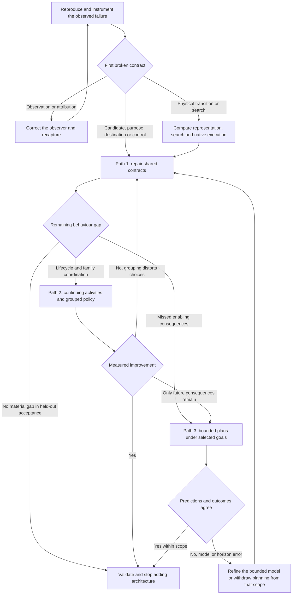

# Three conditional routes from recorded behaviour to the intended companion

**Recommendation, 12 September 2026: start with Path 1, preserve utility selection while making opportunity validity, activity progress and control ownership explicit.** Path 2 is the strongest alternative if cross-purpose coordination remains difficult after those contracts are sound. Path 3 becomes preferable when matched scenarios demonstrate consequential choices that local opportunity evaluation consistently misses. All three retain the closed authored ability kit, NPC body, native integration boundaries and player-relative product role unless an experiment identifies a specific defect there.

This folder contains exactly the requested four files. The proposals are research recommendations, not accepted architecture or implementation authorisation. They describe conditional routes towards the full Expected Behaviour; no finite desk study can establish that any route will achieve it perfectly in all future Terraria/mod combinations.

```text
proposal/
├─ CLAUDE.md                                               aggregated results, ranking and reading order
├─ 01 Preserve Utility and Repair Activity Contracts.md    highest confidence next course
├─ 02 Organise Utility Around Continuing Activities.md     hierarchy and explicit activity execution
└─ 03 Add Bounded Planning for Consequential Choices.md     short consequence-aware plans under utility goals
```

## The ranking uses product requirements rather than attachment to the code

The comparison axes come from the owner's accepted examples and concern about repeated churn: expressive fit, truthful feasibility, coherent simultaneous actions, runtime cost, compatibility, diagnosis, reversibility and capability growth. Their derivation is in [Behaviour, Opportunities and Comparison Criteria](<../Decision Architecture/Behaviour, Opportunities and Comparison Criteria.md>). The ranking is an engineering judgement from current evidence, not a numerical prediction of eventual success.

| Axis | Path 1: explicit contracts within utility | Path 2: grouped continuing activities | Path 3: bounded consequential planning |
|---|---|---|---|
| Desired contextual choices | Directly represents concrete opportunities and remaining work. | Adds family-level policy and visible activity phases. | Adds comparison of future effects and alternative methods. |
| Immediate recorded defects | Reaches candidate omissions, misleading progress, invalid destinations and handoffs directly. | Reaches lifecycle/ownership failures, after the same evidence repairs. | Inherits evidence repairs; planning alone does not fix the recorded failures. |
| Concurrency | Explicit grants preserve travel/aiming and coherent tools. | Activity phases make grants/abort boundaries visible. | Plans must declare shared resources and still use the same grants. |
| Physical reliability | Refines current directed graph, local proof and native execution as evidence requires. | Uses the same physical oracle beneath activity execution. | Uses the same oracle for plan preconditions/effects; uncertainty becomes more consequential. |
| Capability growth | Shared capability authority changes eligibility/cost/proofs. | New child activities or local options can isolate ability-specific execution. | Alternative ability methods can be selected by their consequences. |
| New complexity | Smallest initial change, but candidate/state cleanup can expose deeper coupling. | Additional parent/child arbitration and abort semantics. | Largest modelling, search, invalidation and debugging burden. |
| Evidence supporting adoption now | Multiple source defects and recorded handoff/destination mismatches; no selector-family impossibility demonstrated. | Production/research support for explicit execution state and separate outputs; no matched project win yet. | Planning research supports real enabling choices; project benefit remains unmeasured. |
| Main reason it could lose | Flat competition cannot remain legible or affordable as meaningful activities grow. | Hierarchy hides good children, duplicates commitment or merely renames current coupling. | Short plans rely on inaccurate futures or add cost to decisions reactive selection already gets right. |

Path 1 has the highest confidence **as the next investigative course**, not as a guarantee that the current selector and graph should survive unchanged forever. Path 2 has medium conditional confidence where lifecycle complexity proves dominant. Path 3 has medium conditional confidence for consequential subproblems and lower confidence as a whole-brain replacement. There is insufficient evidence to express these judgements as percentages.

## The shared findings identify where churn has come from

The historical record shows both progress and recurrence. Native collision comparisons, actual-entry proof, retained search and directed experience produced useful bounded results. The same record repeatedly promoted a graph result into a physical promise, a body-level signal into task progress, or a retained diagnostic into a current outcome. These are representational and interface mistakes that another chooser would inherit.[^history]

The new source/telemetry audit sharpens the first work. A sampled hunt-position search can omit a usable location yet return absence. A reverse-search timeout can pass the ordinary one-way filter without proving returnability. A navigator can arrive at a destination that does not enable the intended interaction. Mining candidate status and a tool invocation can be mistaken for productive work. The analyser's mixed weapon evidence can be turned into a false universal range diagnosis. Some findings are proven source properties; their contribution to each old playtest is still an unisolated hypothesis.[^implementation][^episodes]

External sources support composition but do not select a universal winner. RimWorld mods show work priorities, incidental detours, job continuation and compatibility conflicts; Starsector AI code separates manoeuvre, attack and firing-sequence targets; platformer research separates state representation, simulation and search. BTs, options and BDI offer explicit continuation concepts; planning and learning need additional models and evidence. None supplies a direct controlled comparison on this companion.[^cases][^decision][^navigation]

## The roadmaps share evidence and diverge where evidence earns a new mechanism



The diagram is a decision graph, not a promise that each arrow is cheap. Every destination has a prepared discriminator in [Experiments and Recorder Requirements](<../Evaluation and Observability/Experiments and Recorder Requirements.md>). The individual proposals spell out what to change, what outcome to expect, what would refute it and where to go next.

## All paths begin with one concrete experiment

Start with **E01 and E02 on the ore/pot stall and arrived-without-shot hunt**, after the implementation work is authorised. Correct the analyser's evidence semantics, add fresh decision/activity/attempt identities and productive outcomes, then compare the full brain with a held purpose and a native-valid held destination. Preserve native physics and control interruption in the test.

If holding the purpose resolves the stall, inspect selection/continuation. If only a validated destination resolves it, inspect candidate generation and purpose success. If even that destination fails, inspect actual-entry proof, controls and native execution. If the original signature cannot be reproduced, obtain the missing capture instead of tuning against an invented surrogate. This first fork is useful under every proposed architecture.

## Full behavioural acceptance remains wider than the immediate bug fixes

The roadmaps continue through player-relative autonomy, spatial light opportunities, incidental pots/loot, risk-sensitive work, effective protection, boss/event policy, capability scaling, returnability, courtesy, downing/recovery, inventory/protection and readable diagnostics. The [Behavioural Acceptance Matrix](<../Evaluation and Observability/Behavioural Acceptance Matrix.md>) provides positive cases, changed circumstances and failure branches for all twenty-seven README responsibilities, complementing the eighteen synthesised requirements. A companion that mines reliably but still wanders after unreachable enemies has not completed the work.

Some acceptance criteria require owner judgement after observable evidence is available: how much small damage is acceptable for work, how much independence feels companionable, and how aggressive unfamiliar-threat caution should be. Those are narrower choices than another open-ended requirements interview. Existing research can prepare their comparisons, but cannot honestly claim to have made the owner's future playtest judgement.

## Re-evaluate dated evidence without discarding the research

Source findings are pinned to `d60b92b`/gameplay `4296f85`; runtime observations name older captures and hashes. A change to the related implementation triggers a re-read of those findings, not a rewrite of the product requirements or the algorithm literature. Each path gives a reversal condition so a failed hypothesis remains informative rather than disappearing beneath its replacement.

The [140-question answer ledger](<../Evaluation and Observability/Question Answers and Remaining Evidence.md>) records where desk/source research provides an answer and where an explicit experiment or inaccessible evidence remains. “Research complete” means the questions have evidence-based answers or bounded unknowns with a way to resolve them; it does not mean the unbuilt proposals have passed their experiments.

## Appendix: evidence feeding the ranking

[^history]: [Pivotal Decisions and Conversation Evidence](<../Historical Evidence/Pivotal Decisions and Conversation Evidence.md>), [complete commit coverage](<../Historical Evidence/Commit Chronology and Coverage Ledger.md>) and [diagnostic history](<../Historical Evidence/Diagnostic Instruments, Contradictions and Open Questions.md>). Includes pre-utility rationale, rejected diagnoses, route-memory gains/limits and commitment-proxy reversal.
[^implementation]: [Decisions, Activities and Shared Controls](<../Implementation Evidence/Decisions, Activities and Shared Controls.md>) and [Routes, Returnability and Physical Execution](<../Implementation Evidence/Routes, Returnability and Physical Execution.md>). These identify exact producer/consumer contracts and distinguish source counterexamples from captured causes.
[^episodes]: [Recorded Episodes and Measurement Limits](<../Evaluation and Observability/Recorded Episodes and Measurement Limits.md>) and [input inventory](<../Evaluation and Observability/Recording Inventory and Reproduction.md>). Old-build recordings do not constitute an after-test of present source.
[^cases]: [RimWorld](<../Game and Mod Case Studies/RimWorld Work Scheduling.md>), [Starsector](<../Game and Mod Case Studies/Starsector Ship and Weapon AI.md>) and [Terraria](<../Game and Mod Case Studies/Terraria NPC and Companion Boundaries.md>), with primary source links, version limits and counterevidence.
[^decision]: [Decision, Commitment and Computation](<../Decision Architecture/Decision, Commitment and Computation.md>) and [Utility AI and Its Alternatives](<../Utility AI and Its Alternatives.md>), covering utility, HFSM/BT, BDI, options, GOAP/HTN and bounded learning.
[^navigation]: [Dynamic Platformer Navigation](<../Navigation Research/Dynamic Platformer Navigation.md>), covering A*, LPA*/D* Lite, anytime/real-time search, state representation, experience and conditional safe prefixes.
